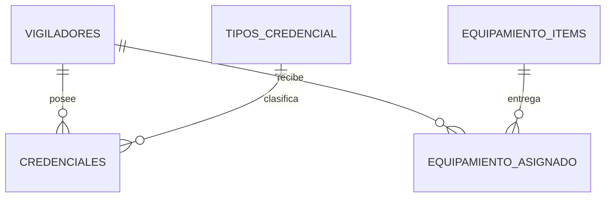
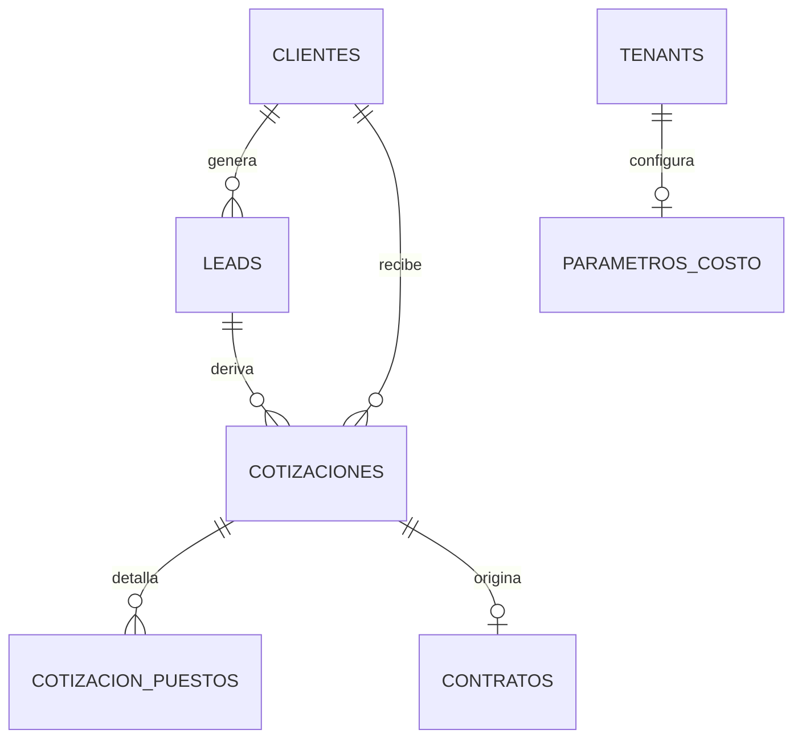
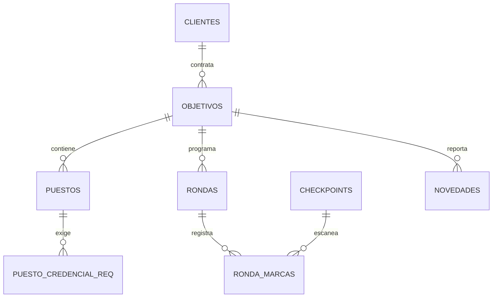
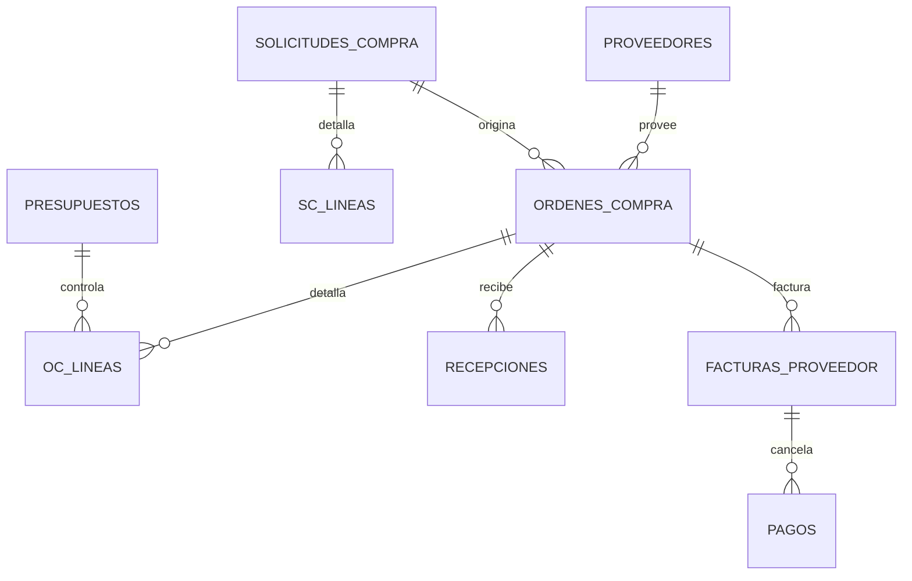
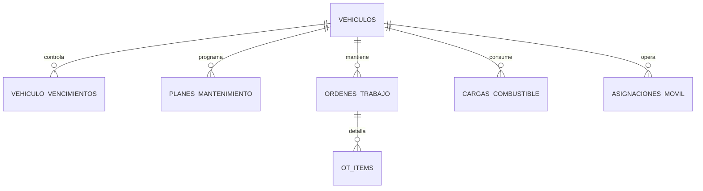

# Modelos de datos y lógica — Módulos M2 a M6 + Plataforma

> Complementa al prompt arquitectónico general y al spec de M1 (motor de tiempo). Mismas reglas transversales: multi-tenancy (`tenant_id` + RLS), soft-delete, auditoría, timestamps, español rioplatense, numeración y máquinas de estado del prompt general. "DEBE" es obligatorio; "PUEDE" queda a criterio de implementación. Cuando una tabla ya fue definida en M1 (ej. `puesto_cobertura`, `contrato_facturacion`) acá solo se referencia.

---

## M2 — Maestro de personal y credenciales

### Propósito

El producto que vende la empresa es la gente. M2 es el registro autoritativo de vigiladores, sus credenciales habilitantes y el equipamiento asignado. Expone el servicio `credencialVigente()` que **M1 y M4 consumen para bloquear asignaciones**.

### Modelo de datos



```sql
create table vigiladores (
  id uuid primary key default gen_random_uuid(),
  tenant_id uuid not null,
  legajo_nro text not null,
  nombre text not null,
  apellido text not null,
  documento text not null,
  fecha_nacimiento date,
  fecha_ingreso date,
  telefono text,
  talles jsonb,                         -- {"camisa":"L","pantalon":42,"calzado":43}
  estado text not null default 'ACTIVO',-- ACTIVO | SUSPENDIDO | BAJA
  created_at timestamptz not null default now(),
  deleted_at timestamptz,
  unique (tenant_id, legajo_nro)
);

create table tipos_credencial (
  id uuid primary key default gen_random_uuid(),
  tenant_id uuid not null,
  codigo text not null,                 -- CARNET_VIGILADOR | PSICOFISICO | ANTECEDENTES | ANMAC | CAPACITACION
  nombre text not null,
  requiere_para_armado boolean not null default false,
  unique (tenant_id, codigo)
);

create table credenciales (
  id uuid primary key default gen_random_uuid(),
  tenant_id uuid not null,
  vigilador_id uuid not null references vigiladores(id),
  tipo_credencial_id uuid not null references tipos_credencial(id),
  numero text,
  organismo text,                       -- provincia / ANMAC / proveedor de capacitación
  emitida_el date,
  vence_el date,                        -- null = sin vencimiento
  archivo_url text,                     -- MinIO
  estado text not null default 'VIGENTE'-- VIGENTE | POR_VENCER | VENCIDA (derivado por job)
);
create index on credenciales (tenant_id, vence_el);

create table equipamiento_items (
  id uuid primary key default gen_random_uuid(),
  tenant_id uuid not null,
  tipo text not null,                   -- UNIFORME | RADIO | ARMA | CHALECO | OTRO
  descripcion text not null,
  serie text,                           -- para armas/radios
  requiere_anmac boolean not null default false
);

create table equipamiento_asignado (
  id uuid primary key default gen_random_uuid(),
  tenant_id uuid not null,
  vigilador_id uuid not null references vigiladores(id),
  item_id uuid not null references equipamiento_items(id),
  asignado_el date not null,
  devuelto_el date,
  observaciones text
);
```

### Lógica clave

- **Job diario de vencimientos** (BullMQ): recalcula `estado` de cada credencial (`VIGENTE` / `POR_VENCER` si dentro del umbral 30/15/7 días / `VENCIDA`) y emite `credencial.por_vencer` y `credencial.vencida`. Notifica a RRHH y al supervisor del objetivo donde está asignado el vigilador.
- **Servicio `credencialVigente(vigiladorId, codigoTipo, fechaHora)`**: devuelve `true` solo si existe credencial del tipo con `vence_el >= fechaHora` (o sin vencimiento). Es la función que M1/M4 invocan al asignar. La regla de "puesto armado" usa `tipos_credencial.requiere_para_armado`.
- **Asignación de arma**: crear una fila en `equipamiento_asignado` con un `item` `requiere_anmac = true` DEBE validar que el vigilador tenga credencial ANMAC vigente.

### Criterios de aceptación

1. Alta de vigilador con credenciales; el job marca `POR_VENCER` y `VENCIDA` según umbrales y notifica.
2. `credencialVigente()` devuelve `false` para una credencial vencida y bloquea la asignación en M1.
3. No se puede asignar un arma a un vigilador sin ANMAC vigente.

---

## M3 — Comercial y cotizador (con factor de cobertura)

### Propósito

CRM liviano (lead → cotización → contrato) y el **motor de cotización determinístico**, el diferencial comercial. El cálculo numérico SIEMPRE lo hace el motor, nunca el modelo de IA.

### Modelo de datos



```sql
create table clientes (
  id uuid primary key default gen_random_uuid(),
  tenant_id uuid not null,
  codigo text not null,                 -- CLI-2026-0007
  razon_social text not null,
  cuit text,
  contacto jsonb,
  unique (tenant_id, codigo)
);

create table leads (
  id uuid primary key default gen_random_uuid(),
  tenant_id uuid not null,
  codigo text not null,                 -- LEAD-2026-0103
  cliente_id uuid,                      -- null hasta calificar
  origen text,                          -- WHATSAPP | WEB | REFERIDO | OTRO
  estado text not null default 'NUEVO', -- NUEVO|CONTACTADO|COTIZADO|NEGOCIACION|GANADO|PERDIDO
  notas text,
  unique (tenant_id, codigo)
);

create table cotizaciones (
  id uuid primary key default gen_random_uuid(),
  tenant_id uuid not null,
  cliente_id uuid not null,
  lead_id uuid,
  codigo text not null,                 -- COT-2026-0088-v2
  version int not null default 1,
  estado text not null default 'BORRADOR', -- BORRADOR|ENVIADA|ACEPTADA|RECHAZADA|VENCIDA
  costo_estimado numeric(14,2),         -- línea base para conciliar contra costo real
  precio numeric(14,2),
  margen_estimado numeric(5,4),
  vence_el date,
  unique (tenant_id, codigo)
);

create table cotizacion_puestos (
  id uuid primary key default gen_random_uuid(),
  tenant_id uuid not null,
  cotizacion_id uuid not null references cotizaciones(id),
  descripcion text not null,            -- ej. "Portería 24/7 armada"
  esquema_horario jsonb not null,       -- {"horas_dia":24,"dias":7}
  requiere_arma boolean not null default false,
  requiere_movil boolean not null default false,
  dotacion_calculada numeric(6,2),      -- salida del motor
  hh_periodo numeric(10,2),
  costo numeric(14,2),
  precio numeric(14,2)
);

-- Componentes de costo por tenant (CCT 507/07 simplificado para el MVP)
create table parametros_costo (
  id uuid primary key default gen_random_uuid(),
  tenant_id uuid not null unique,
  sueldo_basico_mensual numeric(14,2) not null,
  adicionales_pct numeric(5,4) not null default 0.0,   -- nocturnidad/antig./presentismo prorrateado
  cargas_sociales_pct numeric(5,4) not null default 0.0,
  art_mensual numeric(14,2) not null default 0,
  uniformes_amortizado_mensual numeric(14,2) not null default 0,
  capacitacion_mensual numeric(14,2) not null default 0,
  supervision_pct numeric(5,4) not null default 0.0,   -- sobre costo laboral
  estructura_pct numeric(5,4) not null default 0.0,
  tasa_ausentismo numeric(5,4) not null default 0.05,
  horas_nominales_mes numeric(8,2) not null default 208 -- 48h/sem aprox
);
```

> `contrato_facturacion` (modo POR_PLANIFICADO / POR_REAL / ABONO_FIJO, tarifa, abono, redondeo) ya está definido en el spec de M1 y se crea al ganar la cotización.

### Motor de cotización (factor de cobertura)

Servicio de dominio puro. Por cada puesto cotizado:

```ts
function cotizarPuesto(p: CotizacionPuesto, params: ParametrosCosto, tenant: Tenant, diasPeriodo = 30) {
  // 1) Horas a cubrir del puesto en el período
  const H_cubrir = p.esquema_horario.horas_dia * (p.esquema_horario.dias / 7) * diasPeriodo;

  // 2) Horas efectivas reales de un vigilador en el período
  const H_efectiva = params.horas_nominales_mes * (1 - params.tasa_ausentismo);

  // 3) Dotación necesaria (equivale a aplicar el factor de cobertura)
  //    Para 24/7 da ~4.2; el tenant puede forzar tenant.factor_cobertura.
  const dotacion = H_cubrir / H_efectiva;

  // 4) Costo laboral mensual por vigilador
  const costoLaboralVig =
      params.sueldo_basico_mensual * (1 + params.adicionales_pct) * (1 + params.cargas_sociales_pct)
    + params.art_mensual + params.uniformes_amortizado_mensual + params.capacitacion_mensual;

  // 5) Costo del puesto (laboral + supervisión + estructura + móvil si aplica)
  let costo = dotacion * costoLaboralVig;
  costo += costo * params.supervision_pct;
  costo += costo * params.estructura_pct;
  if (p.requiere_movil) costo += costoMovilProrrateado(tenant);   // desde M6

  // 6) Precio con margen objetivo
  const precio = costo * (1 + tenant.margen_objetivo);

  return {
    dotacion_calculada: round2(dotacion),
    hh_periodo: round2(H_cubrir),
    costo: round2(costo),
    precio: round2(precio),
    precio_hora: round2(precio / H_cubrir),
  };
}
```

La cotización suma los puestos, guarda `costo_estimado` (línea base que luego se compara contra el costo real de M1/M5/M6) y queda versionada: editar una cotización `ENVIADA` crea `v(N+1)` y deja la anterior inmutable.

Ejemplo: puesto 24/7, sueldo básico $600.000, adicionales 35%, cargas 30%, ART $40.000, ausentismo 5%, horas nominales 208 → `H_cubrir` ≈ 720, `H_efectiva` ≈ 197.6, `dotacion` ≈ 3.64 (sube a ~4.2 si el tenant fuerza el factor por vacaciones/feriados). Cotizar con dotación 1 en vez de ~4 es el error que funde a estas empresas; el motor lo evita por construcción.

### Criterios de aceptación

1. Cotizar un puesto 24/7 devuelve dotación coherente con el factor de cobertura y desglose costo/precio/margen.
2. La cotización se versiona; la versión enviada queda inmutable.
3. Ganar la cotización crea el contrato con su `contrato_facturacion`.

---

## M4 — Operaciones (objetivos, puestos, relevos, rondas, novedades)

### Propósito y límite con M1

M4 es el **maestro de objetivos y puestos** (incluidos sus requisitos y necesidad de cobertura) y la operación diaria: rondas de supervisión y libro de novedades. El **cuadrante y el algoritmo de relevo viven en M1**; M4 los dispara y los muestra, pero no los recalcula.

### Modelo de datos



```sql
create table objetivos (
  id uuid primary key default gen_random_uuid(),
  tenant_id uuid not null,
  cliente_id uuid not null references clientes(id),
  codigo text not null,                 -- OBJ-2026-0015
  nombre text not null,
  direccion text,
  geocerca jsonb,                       -- {"lat":..,"lng":..,"radio_m":150}
  unique (tenant_id, codigo)
);

create table puestos (
  id uuid primary key default gen_random_uuid(),
  tenant_id uuid not null,
  objetivo_id uuid not null references objetivos(id),
  nombre text not null,
  requiere_arma boolean not null default false,
  requiere_movil boolean not null default false,
  esquema_horario jsonb not null
);

create table puesto_credencial_req (
  id uuid primary key default gen_random_uuid(),
  tenant_id uuid not null,
  puesto_id uuid not null references puestos(id),
  tipo_credencial_codigo text not null  -- consumido por credencialVigente() de M2
);

-- puesto_cobertura (dotación requerida + ventana) ya definido en M1.

create table checkpoints (
  id uuid primary key default gen_random_uuid(),
  tenant_id uuid not null,
  objetivo_id uuid not null references objetivos(id),
  nombre text not null,
  codigo_qr text,                       -- o tag NFC
  orden int
);

create table rondas (
  id uuid primary key default gen_random_uuid(),
  tenant_id uuid not null,
  objetivo_id uuid not null references objetivos(id),
  vigilador_id uuid,
  inicio timestamptz,
  fin timestamptz,
  estado text not null default 'EN_CURSO' -- EN_CURSO | COMPLETA | INCOMPLETA
);

create table ronda_marcas (
  id uuid primary key default gen_random_uuid(),
  tenant_id uuid not null,
  ronda_id uuid not null references rondas(id),
  checkpoint_id uuid not null references checkpoints(id),
  marcada_en timestamptz not null,
  lat numeric(9,6), lng numeric(9,6)
);

create table novedades (
  id uuid primary key default gen_random_uuid(),
  tenant_id uuid not null,
  objetivo_id uuid not null references objetivos(id),
  vigilador_id uuid,
  ocurrida_en timestamptz not null default now(),
  severidad text not null default 'INFO', -- INFO | ADVERTENCIA | INCIDENTE | CRITICA
  descripcion text not null,
  foto_url text                         -- MinIO
);
```

### Lógica clave

- Una **ronda** se considera `COMPLETA` si registra todos los `checkpoints` del objetivo dentro de la ventana esperada; si faltan, `INCOMPLETA` y notifica al supervisor.
- El **libro de novedades** es append-only: las novedades no se editan ni borran (soft-delete deshabilitado); una corrección es una novedad nueva que referencia la anterior.
- Una novedad `CRITICA` emite `novedad.critica` → notificación inmediata (in-app + WhatsApp al supervisor/gerencia).
- El botón "buscar relevo" de la UI de M4 invoca `sugerirRelevos()` de M1.

### Criterios de aceptación

1. Alta de objetivo con puestos, requisitos de credencial y checkpoints.
2. Una ronda sin todos los checkpoints queda `INCOMPLETA` y notifica.
3. Una novedad crítica dispara notificación inmediata; el libro es inmutable.

---

## M5 — Compras (control de salidas de dinero, imputación a contrato)

### Propósito

Dar control sobre cada peso que sale e **imputar el gasto al contrato/objetivo/vehículo correspondiente**, para que el costo real impacte la rentabilidad. Es el espejo de la conciliación de M1: costo presupuestado vs. costo real.

### Modelo de datos



```sql
create table proveedores (
  id uuid primary key default gen_random_uuid(),
  tenant_id uuid not null,
  razon_social text not null,
  cuit text,
  rubro text,
  condicion_pago text                   -- CONTADO | 30D | 60D ...
);

create table solicitudes_compra (
  id uuid primary key default gen_random_uuid(),
  tenant_id uuid not null,
  codigo text not null,                 -- SC-2026-0211
  solicitante_id uuid not null,
  estado text not null default 'PENDIENTE', -- PENDIENTE | APROBADA | RECHAZADA | ORDENADA
  centro_costo text,
  contrato_id uuid, objetivo_id uuid, vehiculo_id uuid,  -- imputación
  unique (tenant_id, codigo)
);

create table sc_lineas (
  id uuid primary key default gen_random_uuid(),
  tenant_id uuid not null,
  solicitud_id uuid not null references solicitudes_compra(id),
  descripcion text not null,
  cantidad numeric(12,2) not null,
  estimado_unit numeric(14,2)
);

create table ordenes_compra (
  id uuid primary key default gen_random_uuid(),
  tenant_id uuid not null,
  proveedor_id uuid not null references proveedores(id),
  codigo text not null,                 -- OC-2026-0190
  estado text not null default 'BORRADOR', -- BORRADOR|APROBADA|ENVIADA|RECIBIDA_PARCIAL|RECIBIDA|FACTURADA|PAGADA|ANULADA
  total numeric(14,2) not null default 0,
  aprobada_por uuid,
  unique (tenant_id, codigo)
);

create table oc_lineas (
  id uuid primary key default gen_random_uuid(),
  tenant_id uuid not null,
  orden_compra_id uuid not null references ordenes_compra(id),
  descripcion text not null,
  cantidad numeric(12,2) not null,
  cantidad_recibida numeric(12,2) not null default 0,
  precio_unit numeric(14,2) not null,
  subtotal numeric(14,2) not null,
  centro_costo text,
  contrato_id uuid, objetivo_id uuid, vehiculo_id uuid, orden_trabajo_id uuid  -- imputación
);

create table recepciones (
  id uuid primary key default gen_random_uuid(),
  tenant_id uuid not null,
  orden_compra_id uuid not null references ordenes_compra(id),
  fecha date not null,
  detalle jsonb not null                -- [{oc_linea_id, cantidad}]
);

create table facturas_proveedor (
  id uuid primary key default gen_random_uuid(),
  tenant_id uuid not null,
  orden_compra_id uuid not null references ordenes_compra(id),
  nro_comprobante text,
  fecha date,
  total numeric(14,2) not null,
  vencimiento_pago date
);

create table pagos (
  id uuid primary key default gen_random_uuid(),
  tenant_id uuid not null,
  factura_id uuid not null references facturas_proveedor(id),
  fecha date not null,
  importe numeric(14,2) not null,
  medio text
);

create table presupuestos (
  id uuid primary key default gen_random_uuid(),
  tenant_id uuid not null,
  centro_costo text,
  contrato_id uuid,
  periodo_desde date, periodo_hasta date,
  monto numeric(14,2) not null
);
```

### Lógica clave

- **Flujo:** SC (`PENDIENTE`) → aprobación → OC desde SC aprobadas → aprobación por monto → `ENVIADA` → recepción (parcial/total, actualiza `cantidad_recibida` y estado) → factura → pago.
- **Aprobación por monto:** umbrales por tenant (ej. < X aprueba `SUPERVISOR`; ≥ X aprueba `GERENCIA`). Una OC no pasa a `ENVIADA` sin aprobación del rol correspondiente. Queda en auditoría.
- **Control de presupuesto:** al aprobar una OC, si `(comprometido + ejecutado + total OC) > presupuesto` del centro/contrato, advierte (o bloquea si el tenant lo configura así).
- **Imputación al margen:** cada `oc_linea` con `contrato_id`/`objetivo_id` se acumula como costo real de compras del contrato y emite `compra.imputada` → rentabilidad. Las líneas con `vehiculo_id`/`orden_trabajo_id` alimentan el TCO de M6.

### Criterios de aceptación

1. SC → OC con aprobación por monto → recepción parcial → factura → pago, con estados correctos.
2. Cada línea imputada aparece en `/contratos/:id/costos`.
3. Una OC que excede el presupuesto del centro de costo advierte (o bloquea según config).

---

## M6 — Flota (mantenimiento y seguimiento de móviles)

### Propósito

Mantener los móviles operativos, controlar vencimientos críticos y **trazar el costo total de cada vehículo, imputable a las operaciones que lo usan**. Expone `movilDisponibleYVigente()` que M1 consume al asignar un puesto que requiere móvil.

### Modelo de datos



```sql
create table vehiculos (
  id uuid primary key default gen_random_uuid(),
  tenant_id uuid not null,
  codigo text not null,                 -- MOV-0012
  patente text not null,
  marca_modelo text,
  anio int,
  tipo text not null,                   -- COMUN | BLINDADO | MOTO
  km_actual int not null default 0,
  estado text not null default 'OPERATIVO', -- OPERATIVO | EN_TALLER | BAJA
  unique (tenant_id, codigo)
);

create table vehiculo_vencimientos (
  id uuid primary key default gen_random_uuid(),
  tenant_id uuid not null,
  vehiculo_id uuid not null references vehiculos(id),
  tipo text not null,                   -- VTV | SEGURO | PATENTE | HABILITACION_CAUDALES
  vence_el date not null,
  estado text not null default 'VIGENTE' -- VIGENTE | POR_VENCER | VENCIDO (job)
);

create table planes_mantenimiento (
  id uuid primary key default gen_random_uuid(),
  tenant_id uuid not null,
  vehiculo_id uuid not null references vehiculos(id),
  tipo text not null,                   -- SERVICE | NEUMATICOS | FRENOS ...
  disparo text not null,                -- KM | TIEMPO
  cada_km int,                          -- si KM
  cada_meses int,                       -- si TIEMPO
  ultimo_km int, ultima_fecha date
);

create table ordenes_trabajo (
  id uuid primary key default gen_random_uuid(),
  tenant_id uuid not null,
  vehiculo_id uuid not null references vehiculos(id),
  codigo text not null,                 -- OT-2026-0077
  tipo text not null,                   -- PREVENTIVA | CORRECTIVA
  estado text not null default 'ABIERTA', -- ABIERTA | EN_PROCESO | CERRADA | CANCELADA
  km_al_abrir int,
  taller text,
  costo_total numeric(14,2) not null default 0,
  unique (tenant_id, codigo)
);

create table ot_items (
  id uuid primary key default gen_random_uuid(),
  tenant_id uuid not null,
  orden_trabajo_id uuid not null references ordenes_trabajo(id),
  descripcion text not null,            -- repuesto o mano de obra
  costo numeric(14,2) not null,
  oc_linea_id uuid                      -- si el repuesto vino de una OC de M5
);

create table cargas_combustible (
  id uuid primary key default gen_random_uuid(),
  tenant_id uuid not null,
  vehiculo_id uuid not null references vehiculos(id),
  fecha date not null,
  litros numeric(8,2) not null,
  importe numeric(14,2) not null,
  km int not null,
  rendimiento numeric(6,2),             -- km/l calculado
  contrato_id uuid, objetivo_id uuid    -- imputación
);

create table asignaciones_movil (
  id uuid primary key default gen_random_uuid(),
  tenant_id uuid not null,
  vehiculo_id uuid not null references vehiculos(id),
  objetivo_id uuid, contrato_id uuid,
  desde timestamptz not null, hasta timestamptz
);
```

### Lógica clave

- **Mantenimiento preventivo:** un job evalúa cada plan; al alcanzar `km_actual − ultimo_km >= cada_km` o `meses_desde(ultima_fecha) >= cada_meses`, genera una OT `PREVENTIVA` automática y notifica.
- **Bloqueo duro de vencimientos:** `movilDisponibleYVigente()` devuelve `false` si el vehículo tiene VTV o seguro `VENCIDO`, o está `EN_TALLER`/`BAJA`. M1 no asigna un puesto con móvil a un vehículo no apto.
- **Combustible:** al cargar, calcula `rendimiento = (km − km_carga_anterior) / litros` y detecta consumos anómalos (umbral configurable) → notificación.
- **TCO e imputación:** `costo_total_vehiculo = depreciación + Σ OT + Σ combustible`; se prorratea por `asignaciones_movil` a los contratos/objetivos del período y emite `flota.imputada` → rentabilidad.

### Criterios de aceptación

1. Un plan por km genera una OT preventiva al superar el umbral y notifica.
2. Un móvil con VTV/seguro vencido no puede asignarse (bloqueo en M1).
3. Carga de combustible calcula rendimiento; TCO por vehículo imputado a sus contratos.

---

## Plataforma

### Multi-tenancy

- RLS por `tenant_id` en todas las tablas de negocio. El backend setea `app.tenant_id` por request (derivado del JWT) en la sesión de la conexión; las políticas usan `using (tenant_id = current_setting('app.tenant_id')::uuid)`.
- Tests obligatorios de aislamiento: un usuario del tenant A no lee ni escribe datos del tenant B por ningún endpoint.

### Autenticación

- JWT con `access_token` (corto) + `refresh_token` (rotativo, revocable). El access lleva `tenant_id`, `user_id` y `roles`.
- Contraseñas con hash fuerte (argon2/bcrypt). Bloqueo por intentos fallidos.

### RBAC

Roles del MVP y alcance:

| Rol | Alcance |
|---|---|
| `ADMIN` | Todo dentro del tenant, incluida configuración |
| `GERENCIA` | Costos, márgenes, aprobaciones de monto alto, reapertura de períodos |
| `SUPERVISOR` | Operación, rondas, novedades, relevos, aprobaciones de monto bajo |
| `OPERADOR` | Cuadrante y asistencia, sin ver costos |
| `RRHH` | Personal y credenciales |
| `COMPRAS` | Compras y proveedores |

- Guardas a nivel endpoint (NestJS) y **a nivel campo** donde corresponda: los montos de costo/margen solo los ven `GERENCIA`/`ADMIN`. Un `OPERADOR` ve el cuadrante pero no la tarifa ni el costo laboral.

### Auditoría

```sql
create table auditoria (
  id uuid primary key default gen_random_uuid(),
  tenant_id uuid not null,
  actor_id uuid not null,
  entidad text not null,                -- 'ordenes_compra', 'cotizaciones', ...
  entidad_id uuid not null,
  accion text not null,                 -- CREAR | EDITAR | APROBAR | ANULAR | CERRAR | REABRIR
  antes jsonb, despues jsonb,
  ocurrida_en timestamptz not null default now()
);
```

Acciones sensibles que DEBEN auditarse: aprobación/anulación de OC, edición de cotización, cierre/reapertura de período, baja de vehículo, alta/edición de credencial, cambios de rol.

### Notificaciones

```sql
create table notificaciones (
  id uuid primary key default gen_random_uuid(),
  tenant_id uuid not null,
  destinatario_id uuid not null,
  tipo text not null,                   -- CREDENCIAL_POR_VENCER | NOVEDAD_CRITICA | OC_APROBAR | VENCIMIENTO_FLOTA ...
  canal text not null,                  -- IN_APP | EMAIL | WHATSAPP
  payload jsonb not null,
  leida boolean not null default false,
  enviada_en timestamptz
);
```

- Motor de notificaciones dirigido por eventos de dominio (los listados en cada módulo). Un worker BullMQ consume eventos y despacha por el canal según preferencias del destinatario.

### Canal WhatsApp (cotización/consulta)

- Abstracción `ChannelProvider` (interfaz `recibir(mensaje)` / `enviar(destino, mensaje)`) para no acoplarse al proveedor.
- Webhook entrante → orquestador de conversación que mantiene estado de sesión (en Redis) → llama a Claude con las herramientas expuestas.
- **Herramientas (function calling) que el modelo PUEDE invocar:** `calcular_cotizacion` (motor determinístico de M3), `consultar_novedades` (M4), `consultar_cuadrante` (M1). El modelo nunca calcula precios ni inventa datos operativos; solo orquesta la conversación y presenta lo que devuelven las herramientas.
- Llamadas a la API de Anthropic server-side; la API key nunca llega al cliente.

### Criterios de aceptación (plataforma)

1. Aislamiento entre tenants verificado por test en todos los módulos.
2. Un `OPERADOR` no ve montos de costo/margen en ningún endpoint.
3. Toda acción sensible queda en `auditoria` con `antes`/`despues`.
4. Un evento de dominio (ej. `novedad.critica`) produce una notificación por el canal correcto.
5. Una cotización armada por WhatsApp usa `calcular_cotizacion` (motor), no un número inventado por el modelo.

---

## Mapa de dependencias entre módulos

| Provee | Consume | Vía |
|---|---|---|
| M2 | M1, M4 | `credencialVigente()` (bloqueo de asignación) |
| M4 | M1 | objetivos, puestos, `puesto_cobertura`, requisitos |
| M6 | M1 | `movilDisponibleYVigente()` |
| M3 | M1, Rentabilidad | contrato + `contrato_facturacion`, `costo_estimado` (línea base) |
| M1 | Rentabilidad | HH por concepto al cerrar período |
| M5 | M6, Rentabilidad | `compra.imputada` (repuestos a OT, costo a contrato) |
| M6 | Rentabilidad | `flota.imputada` (TCO prorrateado) |
| Plataforma | Todos | tenancy, auth, RBAC, auditoría, notificaciones, WhatsApp |

Con M1 a M6 + plataforma especificados, el siguiente paso es el esquema de agentes para desarrollarlos por módulo, respetando este mapa de dependencias como orden de construcción.
