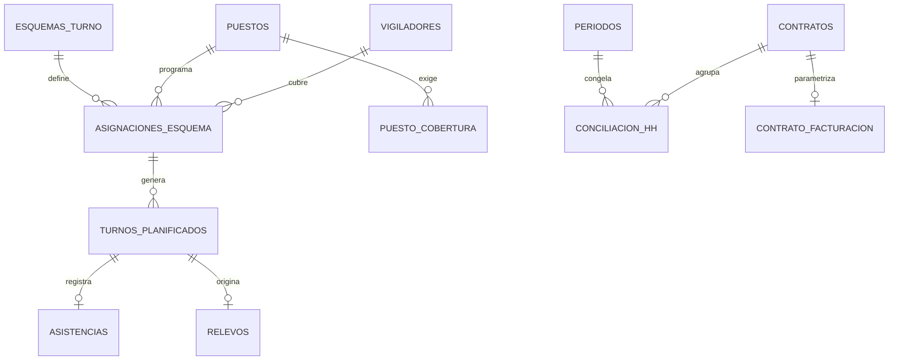

# Modelo de datos y lógica — Motor de tiempo (HH) y cuadrante (M1)

> Especificación detallada del módulo núcleo. Complementa al prompt arquitectónico general. Donde dice "DEBE" es obligatorio; "PUEDE" queda a criterio de implementación. Todo el módulo respeta multi-tenancy (`tenant_id` + RLS), soft-delete, auditoría y español rioplatense.

---

## 1. Por qué este módulo es el más delicado

Tres cosas que parecen simples y no lo son:

1. **Generar turnos concretos a partir de patrones rotativos** (12×12, 24×48, etc.) sobre un rango de fechas, con vigiladores escalonados para que el puesto nunca quede descubierto.
2. **Validar restricciones laborales reales** (descanso entre jornadas, topes semanales, días consecutivos) además de credenciales y disponibilidad de móvil.
3. **Conciliar cuatro cubetas de HH** que no se derivan en cascada: planificadas → facturables (vía contrato) y planificadas → reales → a pagar (vía adicionales). El margen vive entre la facturación (HH facturables × tarifa) y el costo (HH a pagar valorizadas).

---

## 2. Glosario del dominio

| Término | Definición |
|---|---|
| Puesto | Posición a cubrir dentro de un objetivo (ej. "portería principal"). Tiene requisitos y una necesidad de cobertura. |
| Esquema de turno | Patrón rotativo abstracto (ciclo de N días con bloques de trabajo y francos). |
| Asignación de esquema | Vínculo recurrente vigilador↔puesto↔esquema, con posición en el ciclo y fecha ancla. Genera turnos. |
| Turno planificado | Turno concreto con fecha/hora, derivado de una asignación de esquema. |
| Asistencia | Registro real de un turno (fichaje de entrada/salida). |
| Relevo | Reemplazo de un turno ausente por otro vigilador. |
| Período | Ventana de liquidación/facturación (quincena o mes) que se cierra y congela. |
| Conciliación HH | Snapshot por período/contrato de las cuatro cubetas de horas. |
| Ventana nocturna | Franja con recargo (por defecto 21:00–06:00, parametrizable). |
| Factor de cobertura | Dotación necesaria por puesto considerando francos, vacaciones, feriados y ausentismo. |

---

## 3. Representación del esquema de turno (el corazón del modelado)

Un esquema es un **ciclo de N días**. Cada día del ciclo es un franco o una lista de bloques de trabajo. Cada vigilador asignado al esquema tiene una **posición en el ciclo** (offset) y comparte una **fecha ancla**, de modo que distintos vigiladores caen en días distintos del ciclo y entre todos cubren el puesto de forma continua.

`definicion` se guarda como JSONB:

```json
{
  "dias_ciclo": 4,
  "dias": [
    { "tipo": "TRABAJO", "bloques": [{ "hora_inicio": "06:00", "duracion_horas": 12, "tipo_bloque": "DIURNO" }] },
    { "tipo": "TRABAJO", "bloques": [{ "hora_inicio": "18:00", "duracion_horas": 12, "tipo_bloque": "NOCTURNO" }] },
    { "tipo": "FRANCO" },
    { "tipo": "FRANCO" }
  ]
}
```

Para un puesto 24/7 con este esquema 12×12, cuatro vigiladores con posiciones de ciclo 0, 1, 2, 3 y la misma fecha ancla cubren el puesto en rotación. El factor de cobertura del tenant valida que la dotación asignada alcance.

**Atribución de fecha de un turno que cruza medianoche:** el turno pertenece a la fecha de su `inicio_plan`. Esto define el conteo de jornadas y francos. DEBE documentarse y aplicarse consistentemente.

---

## 4. Reglas laborales (configuración por tenant)

Tabla `reglas_laborales` (una fila por tenant, editable):

| Parámetro | Default | Uso |
|---|---|---|
| `jornada_max_diaria_h` | 12 | Tope de horas por turno/jornada |
| `jornada_max_semanal_h` | 48 | Tope semanal (validación dura) |
| `tope_semanal_con_extra_h` | 60 | Tope absoluto incluso con horas extra |
| `descanso_min_entre_jornadas_h` | 12 | Descanso obligatorio entre dos turnos |
| `max_dias_consecutivos` | 6 | Días seguidos sin franco |
| `ventana_nocturna_inicio` | 21:00 | Inicio de franja nocturna |
| `ventana_nocturna_fin` | 06:00 | Fin de franja nocturna |
| `factor_cobertura` | 4.20 | Dotación por puesto 24/7 |
| `recargo_nocturno` | 0.00→informativo | El MVP cuenta horas; la valorización es de fase 2 |

---

## 5. Modelo de datos



DDL (PostgreSQL; RLS por `tenant_id` en todas):

```sql
create table esquemas_turno (
  id uuid primary key default gen_random_uuid(),
  tenant_id uuid not null,
  nombre text not null,
  dias_ciclo int not null check (dias_ciclo > 0),
  definicion jsonb not null,           -- ver §3
  created_at timestamptz not null default now(),
  deleted_at timestamptz
);

create table asignaciones_esquema (
  id uuid primary key default gen_random_uuid(),
  tenant_id uuid not null,
  puesto_id uuid not null,
  vigilador_id uuid not null,
  esquema_id uuid not null references esquemas_turno(id),
  posicion_ciclo int not null default 0,   -- offset del vigilador en el ciclo
  fecha_ancla date not null,               -- referencia de rotación
  vigente_desde date not null,
  vigente_hasta date,                      -- null = abierta
  created_at timestamptz not null default now()
);

create table turnos_planificados (
  id uuid primary key default gen_random_uuid(),
  tenant_id uuid not null,
  puesto_id uuid not null,
  vigilador_id uuid not null,
  asignacion_esquema_id uuid references asignaciones_esquema(id),
  inicio_plan timestamptz not null,
  fin_plan timestamptz not null,
  tipo_bloque text,                        -- DIURNO | NOCTURNO | MIXTO
  estado text not null default 'PLANIFICADA',  -- ver máquina de estados
  check (fin_plan > inicio_plan)
);
create index on turnos_planificados (tenant_id, vigilador_id, inicio_plan);
create index on turnos_planificados (tenant_id, puesto_id, inicio_plan);

create table asistencias (
  id uuid primary key default gen_random_uuid(),
  tenant_id uuid not null,
  turno_id uuid not null references turnos_planificados(id),
  inicio_real timestamptz,
  fin_real timestamptz,
  metodo text,                             -- GEO | QR | NFC | MANUAL
  lat numeric(9,6), lng numeric(9,6),
  estado text not null default 'PENDIENTE' -- PENDIENTE | OK | OBSERVADA | AUSENTE
);

create table relevos (
  id uuid primary key default gen_random_uuid(),
  tenant_id uuid not null,
  turno_original_id uuid not null references turnos_planificados(id),
  turno_relevo_id uuid not null references turnos_planificados(id),
  motivo text,
  created_at timestamptz not null default now()
);

create table puesto_cobertura (
  id uuid primary key default gen_random_uuid(),
  tenant_id uuid not null,
  puesto_id uuid not null,
  dotacion_requerida int not null default 1,
  ventana jsonb not null                   -- ej. {"horas_dia":24,"dias":[1,2,3,4,5,6,7]}
);

create table periodos (
  id uuid primary key default gen_random_uuid(),
  tenant_id uuid not null,
  tipo text not null,                      -- QUINCENA | MES
  desde date not null,
  hasta date not null,
  estado text not null default 'ABIERTO'   -- ABIERTO | EN_CIERRE | CERRADO
);

create table contrato_facturacion (
  id uuid primary key default gen_random_uuid(),
  tenant_id uuid not null,
  contrato_id uuid not null unique,
  modo text not null,                      -- POR_PLANIFICADO | POR_REAL | ABONO_FIJO
  tarifa_hora numeric(14,2),
  abono_mensual numeric(14,2),
  redondeo_min int not null default 0,     -- minutos
  penaliza_hueco boolean not null default false
);

create table conciliacion_hh (
  id uuid primary key default gen_random_uuid(),
  tenant_id uuid not null,
  periodo_id uuid not null references periodos(id),
  contrato_id uuid not null,
  puesto_id uuid,
  vigilador_id uuid,
  hh_planificadas numeric(10,2) not null default 0,
  hh_reales numeric(10,2) not null default 0,
  hh_facturables numeric(10,2) not null default 0,
  hh_normales numeric(10,2) not null default 0,
  hh_nocturnas numeric(10,2) not null default 0,
  hh_extra numeric(10,2) not null default 0,
  hh_feriado numeric(10,2) not null default 0,
  congelada boolean not null default false
);
```

### Máquina de estados del turno

```
PLANIFICADA → CONFIRMADA → CUBIERTA      (asistencia OK)
PLANIFICADA → CONFIRMADA → AUSENTE → RELEVADA   (se genera turno de relevo)
cualquiera  → ANULADA
```

---

## 6. Generación del cuadrante

A partir de una asignación de esquema, generar los turnos concretos del rango:

```ts
function generarTurnos(asig: AsignacionEsquema, desde: Date, hasta: Date): Turno[] {
  const { definicion, dias_ciclo: N } = asig.esquema;
  const turnos: Turno[] = [];
  for (const fecha of rangoDias(desde, hasta)) {
    const diasDesdeAncla = diffDias(fecha, asig.fecha_ancla);
    let idx = (diasDesdeAncla + asig.posicion_ciclo) % N;
    if (idx < 0) idx += N;
    const dia = definicion.dias[idx];
    if (dia.tipo === 'FRANCO') continue;
    for (const b of dia.bloques) {
      const inicio = combinar(fecha, b.hora_inicio);          // fecha + hora local
      const fin = sumarHoras(inicio, b.duracion_horas);       // puede cruzar medianoche
      turnos.push({
        puesto_id: asig.puesto_id, vigilador_id: asig.vigilador_id,
        asignacion_esquema_id: asig.id,
        inicio_plan: inicio, fin_plan: fin,
        tipo_bloque: b.tipo_bloque, estado: 'PLANIFICADA',
      });
    }
  }
  return turnos;
}
```

Tras generar, el motor corre la **detección de cobertura** por puesto: para cada minuto de la ventana requerida, verifica que la dotación asignada simultánea sea ≥ `dotacion_requerida`. Reporta huecos (descubierto) y solapamientos (sobre-dotación).

---

## 7. Validación de una asignación (restricciones)

Duras (rechazan) y blandas (advierten):

```ts
function validarTurno(t: Turno, ctx: Contexto): { errores: string[]; avisos: string[] } {
  const e: string[] = [], a: string[] = [];
  const R = ctx.reglas;

  if (existeSolapamiento(t.vigilador_id, t.inicio_plan, t.fin_plan)) e.push('SOLAPAMIENTO');
  if (horasDesdeUltimoTurno(t.vigilador_id, t.inicio_plan) < R.descanso_min_entre_jornadas_h)
    e.push('DESCANSO_INSUFICIENTE');
  if (horasSemana(t.vigilador_id, semanaDe(t)) + duracion(t) > R.jornada_max_semanal_h)
    e.push('EXCEDE_SEMANAL');
  if (diasConsecutivos(t.vigilador_id, t.inicio_plan) >= R.max_dias_consecutivos)
    e.push('EXCEDE_DIAS_CONSECUTIVOS');
  for (const req of ctx.puesto.credenciales_requeridas)
    if (!credencialVigente(t.vigilador_id, req, t.inicio_plan)) e.push(`CREDENCIAL_VENCIDA:${req}`);
  if (ctx.puesto.requiere_movil && !movilDisponibleYVigente(t)) e.push('MOVIL_NO_DISPONIBLE');

  if (generaHorasExtra(t, R)) a.push('GENERA_EXTRA');
  if (francosDesbalanceados(ctx)) a.push('FRANCOS_DESBALANCEADOS');
  if (concentraNocturnidad(t, ctx)) a.push('NOCTURNIDAD_ALTA');
  return { errores: e, avisos: a };
}
```

Una asignación con `errores.length > 0` NO se persiste. Los avisos se muestran pero no bloquean.

---

## 8. Sugerencia de relevos

Ante un turno en `AUSENTE`, proponer reemplazos elegibles y rankeados:

```ts
function sugerirRelevos(turno: Turno, ctx: Contexto): Candidato[] {
  return ctx.vigiladoresActivos
    .filter(v => credencialesOk(v, ctx.puesto, turno.inicio_plan))
    .filter(v => !existeSolapamiento(v.id, turno.inicio_plan, turno.fin_plan))
    .filter(v => respetaDescanso(v.id, turno))
    .filter(v => horasSemana(v.id, semanaDe(turno)) + duracion(turno) <= ctx.reglas.tope_semanal_con_extra_h)
    .map(v => ({ v, score: scoreRelevo(v, turno, ctx) }))
    .sort((x, y) => y.score - x.score);
}
// scoreRelevo: penaliza entrar en horas extra (costo), premia continuidad
// en el mismo puesto/objetivo y reparto equitativo de francos.
```

Aceptar un relevo crea un turno nuevo (`CONFIRMADA`) para el relevista, registra la fila en `relevos` y pasa el original a `RELEVADA`.

---

## 9. Horas nocturnas (intersección con la ventana)

```ts
function horasNocturnas(inicio: Date, fin: Date, R: Reglas): number {
  let total = 0;
  // La ventana cruza medianoche: [21:00, 06:00 del día siguiente]
  for (const dia of diasQueAbarca(inicio, fin)) {
    const vIni = combinar(dia, R.ventana_nocturna_inicio);          // 21:00 de 'dia'
    const vFin = combinar(siguiente(dia), R.ventana_nocturna_fin);  // 06:00 de 'dia+1'
    total += duracionInterseccion([inicio, fin], [vIni, vFin]);
  }
  return total;
}
```

`hh_normales = duracion − hh_nocturnas`. `hh_extra` se calcula sobre lo que excede el tope diario/semanal. `hh_feriado` según el calendario de feriados del tenant.

---

## 10. Conciliación HH del período (las cuatro cubetas)

```ts
function conciliar(contrato: Contrato, periodo: Periodo, R: Reglas): ConciliacionHH {
  const turnos = turnosDelContrato(contrato.id, periodo);

  // 1) Planificadas
  const hh_planificadas = sum(turnos, t => duracion(t.inicio_plan, t.fin_plan));

  // 2) Reales (asistencias OK; el relevo computa para el relevista)
  const hh_reales = sum(turnos.filter(esCubierto), t => duracionReal(t.asistencia));

  // 3) Facturables (NO derivan de reales — derivan del contrato)
  let hh_facturables: number | null;
  switch (contrato.facturacion.modo) {
    case 'POR_PLANIFICADO':
      hh_facturables = hh_planificadas
        - (contrato.facturacion.penaliza_hueco ? hhHuecosNoCubiertos(turnos) : 0);
      break;
    case 'POR_REAL':   hh_facturables = hh_reales; break;
    case 'ABONO_FIJO': hh_facturables = null; break;   // monto fijo; igual se trackea SLA
  }

  // 4) A pagar, descompuestas por concepto (alimentan liquidación futura)
  const hh_nocturnas = sum(turnos.filter(esCubierto), t => horasNocturnas(t.asistencia.inicio_real, t.asistencia.fin_real, R));
  const hh_extra     = horasExtra(turnos, R);
  const hh_feriado   = horasEnFeriado(turnos, contrato.calendario);
  const hh_normales  = hh_reales - hh_nocturnas;       // partición sobre lo real

  return { hh_planificadas, hh_reales, hh_facturables, hh_normales, hh_nocturnas, hh_extra, hh_feriado };
}
```

El módulo de rentabilidad valoriza: `facturacion = hh_facturables × tarifa_hora` (o `abono_mensual`), `costo_laboral = Σ(hh_concepto × precio_concepto)`, y `margen = facturacion − costo_laboral − costos_imputados(compras + flota)`.

---

## 11. Cierre de período

```
ABIERTO → EN_CIERRE → CERRADO
```

- Al pasar a `EN_CIERRE`: se exige que todo turno del período tenga asistencia resuelta (OK / AUSENTE / RELEVADA). Turnos `OBSERVADA` sin validar bloquean el cierre.
- Al `CERRADO`: se persiste el snapshot en `conciliacion_hh` con `congelada = true`; las asistencias del período quedan de solo lectura.
- Reabrir un período cerrado requiere rol `GERENCIA`/`ADMIN` y queda en auditoría.

---

## 12. Eventos de dominio emitidos

| Evento | Consumidores |
|---|---|
| `turno.cubierto` | conciliación, notificaciones |
| `turno.ausente` | sugerencia de relevos, alertas |
| `relevo.aceptado` | conciliación, costos |
| `periodo.cerrado` | rentabilidad, (futuro) liquidación y facturación |
| `credencial.por_vencer` | bloqueo preventivo de futuras asignaciones |

---

## 13. Invariantes y casos borde

- Un vigilador NUNCA tiene dos turnos solapados (invariante validado en escritura).
- Un turno que cruza medianoche pertenece a la fecha de su inicio.
- Fichaje fuera de la geocerca → asistencia `OBSERVADA`; no cuenta como real hasta validación de supervisor.
- Fichaje faltante al cierre → turno `AUSENTE` (HH reales = 0 para ese turno).
- Relevo en cadena (el relevista también falta): se trata como un nuevo `AUSENTE` sobre el turno de relevo.
- Argentina hoy no aplica horario de verano; igual se persiste en UTC y se presenta en `America/Argentina/Buenos_Aires`.
- Cambio de esquema a mitad de período: cerrar la asignación vigente (`vigente_hasta`) y abrir una nueva; los turnos ya generados no se reescriben retroactivamente.

---

## 14. Criterios de aceptación de M1

1. Un esquema 12×12 con cuatro vigiladores (posiciones 0–3, misma ancla) genera un cuadrante que cubre un puesto 24/7 sin huecos ni solapamientos.
2. La validación rechaza una asignación que viola descanso mínimo, tope semanal o días consecutivos, y la que usa una credencial vencida.
3. Una ausencia produce una lista de relevos elegibles rankeada, y aceptar uno deja el turno original en `RELEVADA` y crea el del relevista.
4. El cálculo de horas nocturnas es correcto para un turno 18:00–06:00 (debe dar las horas dentro de 21:00–06:00).
5. La conciliación de un período entrega las cuatro cubetas, con facturables derivadas del contrato (no de las reales) según el modo configurado.
6. El cierre de período congela el snapshot y bloquea ediciones; la reapertura queda auditada.
```
