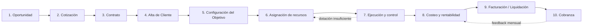

# Camino crítico: de la oportunidad a la cobranza

> Documento de proceso de negocio para Custos. Objetivo: estandarizar el flujo que hoy cada empresa de seguridad maneja de manera artesanal (planillas, WhatsApp, memoria del supervisor) y bajarlo a un camino crítico único dentro de la plataforma, con una salida clara por etapa que habilita la siguiente. Sirve como base para priorizar desarrollo y para diseñar la navegación/UX.
>
> Convención: cada etapa tiene **Objetivo**, **Entidades**, **Estado actual en Custos** (qué ya existe vs gap), **Regla crítica** (lo que no puede saltearse) y **Criterio de salida** (qué tiene que quedar resuelto para avanzar a la próxima etapa). "Estado actual" se relevó contra el código real de `apps/api` y `apps/web` a fecha de este documento.

---

## 1. Por qué el proceso está desordenado hoy (diagnóstico)

En la mayoría de empresas de seguridad el problema no es falta de gente trabajando, es **falta de costura entre las etapas**:

- Se vende sin saber si hay dotación disponible para cubrirlo → contratos que no se pueden armar.
- Se arma el objetivo sin que quede atado al contrato que lo financia → no se sabe si ese puesto es rentable.
- Se factura "a ojo" en base a lo pactado, sin cruzar contra las horas realmente cubiertas → diferencias que se descubren meses después.
- Los costos de vehículos, compras y horas extra se cargan en planillas aparte → la rentabilidad real se conoce, si se conoce, con el balance anual.

El camino crítico de abajo existe justamente para que **cada etapa deje un dato verificable que la siguiente etapa puede consumir**, en vez de depender de que alguien se acuerde de avisar.

---

## 2. Mapa de extremo a extremo

Es un ciclo, no una línea recta: el mes 2 en adelante, las etapas 7→8→9→10 se repiten todos los meses sobre el mismo contrato/objetivo, mientras que 1→6 solo ocurren al vender o ampliar.

---

## 3. Etapas del camino crítico

### Etapa 1 — Oportunidad

**Objetivo de negocio:** registrar que un cliente potencial pidió algo, antes de invertir tiempo en cotizar. Permite medir el funnel (cuántas oportunidades se cierran) y no perder pedidos.

**Entidades:** Oportunidad (lead) → cliente potencial, origen, objetivo tentativo (cantidad de puestos, ubicación, horas estimadas), vendedor responsable, estado.

**Estado actual en Custos:** ❌ No existe. No hay modelo `Oportunidad`/`Lead` ni pantalla. Hoy el proceso arranca directo en Cotización.

**Regla crítica:** una oportunidad no compromete recursos, es solo intención. No debe bloquear ni reservar dotación.

**Criterio de salida:** la oportunidad pasa a "Cotizando" cuando se genera una Cotización asociada.

> Nota de priorización: esta etapa es la de menor urgencia técnica (no bloquea operación), pero es la de mayor valor comercial para el dueño de la empresa de seguridad porque le da visibilidad del embudo de ventas. Conviene construirla como una capa liviana sobre Cotización (estado `BORRADOR` ampliado), no como módulo nuevo separado.

---

### Etapa 2 — Cotización

**Objetivo de negocio:** convertir una necesidad ("necesito cubrir esta planta") en un número con margen conocido, antes de comprometerse.

**Entidades:** `Cotizacion` (cliente_nombre, vencimiento, estado, total_mensual) + `CotizacionItem[]` (horas_mensuales, costo_hora, margen → subtotal calculado con `horas × costo × (1+cargas_sociales) ÷ (1-margen)`).

**Estado actual en Custos:** 🟡 Parcial. El cálculo de subtotal con margen y cargas sociales **ya existe y es correcto** (`cotizacion.service.ts`). Lo que falta:
- Estados `ENVIADA`/`ACEPTADA`/`RECHAZADA` están definidos en el modelo pero **no hay endpoint que los cambie** — quedan en `BORRADOR` para siempre.
- No hay botón "Aceptar cotización" que dispare la creación del Contrato.
- `OPERADOR` no ve costo_hora/subtotal (correcto, mantiene confidencialidad de márgenes frente a operación).

**Regla crítica:** el margen se calcula contra `ConfiguracionCostos` del tenant (costo_hora_base, cargas_sociales, costos_uniforme, otros_costos), nunca a mano. Si cambia la config de costos, las cotizaciones ya enviadas **no** deben recalcularse retroactivamente (son una foto del momento).

**Criterio de salida:** cotización en estado `ACEPTADA` → dispara la creación de un `Contrato` en `BORRADOR`, pre-cargado con cliente, items y total de la cotización.

---

### Etapa 3 — Contrato

**Objetivo de negocio:** formalizar las condiciones comerciales: cómo se factura (planificado, real o abono fijo), tarifa, vigencia.

**Entidades:** `Contrato` (codigo, cliente_nombre, estado, inicio/fin) + `ContratoFacturacion` (modo: `POR_PLANIFICADO` | `POR_REAL` | `ABONO_FIJO`, tarifa_hora, abono_mensual, redondeo_min, penaliza_hueco).

**Estado actual en Custos:** 🟡 Parcial. El modelo y el CRUD existen y están bien diseñados (los 3 modos de facturación cubren los casos reales del rubro). Falta:
- Conexión automática Cotización → Contrato (hoy `cotizacion_id` en Contrato es opcional y se carga a mano).
- No hay relación formal `Cliente`/`Empresa` — todo usa `cliente_nombre: String` libre, repetido en Cotizacion/Contrato/Objetivo sin validar que sea "el mismo cliente" (ver Etapa 4).

**Regla crítica:** un Contrato sin `ContratoFacturacion` configurada no debería poder pasar a `ACTIVO` — sin eso, la Etapa 9 (facturación) no tiene cómo calcular nada. Hoy esto no está validado a nivel backend.

**Criterio de salida:** Contrato en estado `ACTIVO` con `ContratoFacturacion` cargada → habilita dar de alta el/los Objetivo(s) que cubre.

---

### Etapa 4 — Alta de cliente (empresa)

**Objetivo de negocio:** tener un registro único del cliente (razón social, CUIT, contactos, domicilio fiscal) en vez de texto libre repetido en cada cotización/contrato/objetivo, que es la causa típica de "no sé cuánto le facturo en total a este cliente este mes" cuando tiene 5 objetivos.

**Entidades:** ❌ No existe `Cliente`/`Empresa` como entidad. `cliente_nombre` es un campo de texto suelto en `Cotizacion`, `Contrato` y `Objetivo`, sin relación entre sí.

**Estado actual en Custos:** ❌ Gap real, no parcial. Esto es la pieza que falta para que el resto del camino "cierre": sin un Cliente único, no se puede consolidar facturación ni cobranza por cliente cuando tiene varios objetivos/contratos.

**Regla crítica:** el alta de cliente debe ocurrir **una sola vez** y reusarse; cotización y contrato deben referenciarlo por `cliente_id`, no reescribir el nombre.

**Criterio de salida:** Cliente dado de alta con datos fiscales mínimos (razón social, CUIT, domicilio) → todo Contrato nuevo de ese cliente se asocia a este registro, no a un nombre suelto.

> Este es, junto con Facturación (Etapa 9), el gap de mayor impacto. Recomiendo priorizarlo primero porque es la base de datos sobre la que se apoyan Etapas 8, 9 y 10.

---

### Etapa 5 — Configuración del objetivo

**Objetivo de negocio:** traducir el contrato en algo operable: dónde, qué puestos, qué exigencias (arma, móvil), qué esquema horario.

**Entidades:** `Objetivo` (cliente_nombre, codigo, nombre, dirección, lat/lng, estado) + `Puesto[]` (esquema_horario JSON `{horas_dia, dias[]}`, requiere_arma, requiere_movil, ubicación propia).

**Estado actual en Custos:** ✅ Construido en esta sesión (commits previos). Incluye geoposición para mapa en vivo y cálculo de horas mensuales por puesto a partir del esquema horario.

**Regla crítica:** un Objetivo sin `Contrato` activo asociado es un objetivo "fantasma" — se puede operar pero no se puede facturar. Hoy `Objetivo.contrato` se resuelve de forma indirecta (`Contrato.objetivo_id`), conviene blindar en UI que no se pueda activar un Objetivo sin contrato vigente.

**Criterio de salida:** al menos 1 Puesto cargado con esquema horario → la plataforma ya puede calcular cuántas horas mensuales hay que cubrir, que es el insumo de la Etapa 6.

---

### Etapa 6 — Asignación de recursos

Esta es la etapa que pediste detallar especialmente. Se divide en tres sub-flujos que comparten la misma lógica: **¿hay recurso disponible?, ¿cuánto cuesta cubrir con ese recurso?, ¿queda trazado contra el objetivo?**

#### 6.a Horas-hombre (personal)

**Estado actual:** ✅ Construido en esta sesión. `GET /asignaciones?objetivoId=` muestra cuadrante semanal embebido en la ficha del objetivo; asignar valida credenciales vigentes (bloqueo duro); banner de dotación requerida vs disponible en nómina con notificación a ADMIN/RRHH si falta personal.

**Regla crítica ya implementada:** vigilador con credencial vencida no puede asignarse (`ConflictException` 409).

**Gap menor:** la asignación hoy es turno por turno (día por día). Para una empresa con 10+ objetivos y esquemas fijos (ej. 12x36hs todo el mes) cargar día por día es tedioso — ver Etapa 6.d (esquemas recurrentes) más abajo como mejora de UX, no de modelo.

#### 6.b Horas-vehículo

**Estado actual:** ✅ Construido en esta sesión. `GET /vehiculos/disponibles` filtra por operativos sin asignación activa; al asignar se calcula `horas_estimadas_mes × costo_hora` y queda guardado en la asignación (no se recalcula si cambia el esquema después, es una foto del momento — correcto para auditoría).

#### 6.c Horas-arma

**Estado actual:** 🟡 Parcial / inconsistente con las otras dos. Existe `Herramienta` con `tipo: ARMA` y `HerramientaAsignacion` (entrega/devolución a un vigilador), pero:
- No se mide en **horas** como personal y vehículos — es un evento de entrega/devolución, no un período de uso.
- No tiene costo asociado (alquiler, mantenimiento, munición) que se pueda imputar al objetivo/contrato.
- No participa del cálculo de costos/rentabilidad (Etapa 8).

**Recomendación:** alinear armas al mismo patrón que vehículos: agregar `costo_hora` (o costo fijo mensual de tenencia) a `Herramienta` cuando `tipo=ARMA`, y que `HerramientaAsignacion` calcule horas imputadas igual que `AsignacionMovil`. Así las tres "horas" (hombre/vehículo/arma) entran con la misma forma a la Etapa 8.

**Criterio de salida de la Etapa 6 (las tres juntas):** el objetivo tiene su dotación de personal cubierta (banner verde), sus vehículos asignados con costo estimado, y sus armas entregadas con costo imputado — recién ahí el objetivo está "operable al 100%".

---

### Etapa 7 — Ejecución y control

**Objetivo de negocio:** verificar que lo planificado en la Etapa 6 efectivamente pasó (asistencia real, novedades, rondas, eventos del centro de operaciones).

**Estado actual en Custos:** ✅ Construido (fuera del alcance de esta sesión, pre-existente): `Asistencia`, `Novedad`, `Ronda`, `PuntoControl`, ingestión de eventos de `centro-operaciones` con creación automática de incidentes.

**Regla crítica:** la diferencia entre horas planificadas (Etapa 6) y horas reales (esta etapa) es el insumo más importante para los modos de facturación `POR_REAL` y para la `ConciliacionHH` que usa Rentabilidad — hoy ese cruce existe a nivel de modelo (`ConciliacionHH`) pero conviene verificar que se está poblando automáticamente desde Asistencia, no a mano.

**Criterio de salida:** al cierre del período (mensual), todas las asignaciones del mes tienen asistencia registrada o estado explícito (ausente, reemplazo, etc.) — sin esto, la Etapa 8 calcula con huecos.

---

### Etapa 8 — Costeo y rentabilidad

**Objetivo de negocio:** saber, por contrato (idealmente por objetivo), si lo que se factura cubre lo que cuesta.

**Estado actual en Custos:** 🟡 Parcial. `RentabilidadService.rentabilidadPorContrato()` ya calcula `facturación − (costo laboral + compras imputadas + flota imputada)` con flag de erosión de margen. Gaps:
- Es **por contrato**, no por objetivo — si un contrato tiene 3 objetivos, no se sabe cuál es el que pierde plata.
- `costo_laboral` usa `horas_reales × costo_hora_base` plano, sin diferenciar turno normal/nocturno/feriado/extra (hay un TODO explícito en el código).
- Costo de armas no entra (ver 6.c).
- Flota imputada está marcada como TODO de un milestone futuro (M6) en el propio código.

**Regla crítica:** este cálculo debe poder explicar **insumos faltantes** (`incompleto: true`, `insumosFaltantes[]`) en vez de mostrar un número falso — eso ya está bien resuelto en el diseño actual, hay que mantenerlo al extender a horas-arma.

**Criterio de salida:** rentabilidad calculada y sin `incompleto` para el período cerrado → habilita generar la facturación de ese período con confianza de que el margen es real.

---

### Etapa 9 — Facturación / Liquidación mensual

**Objetivo de negocio:** emitir lo que hay que cobrarle a cada cliente, en base al modo de facturación pactado (planificado, real o abono fijo) y a las horas reales conciliadas.

**Estado actual en Custos:** ❌ No existe. No hay modelo `Factura`/`Liquidacion`, ni endpoint que tome `ContratoFacturacion.modo` + `ConciliacionHH` del período y emita un comprobante (o al menos un borrador de monto a facturar). Hoy el dato para facturar existe disperso (Contrato, ConciliacionHH, Rentabilidad) pero nadie lo consolida en un documento.

**Regla crítica (la más importante de toda la etapa):** la liquidación debe ser una **foto inmutable** del período una vez emitida — igual que se hizo con `costo_estimado_mensual` en vehículos, no puede recalcularse silenciosamente si después se corrige una asistencia; un ajuste posterior debe generar una nota de crédito/débito explícita, no editar el número original.

**Criterio de salida:** Liquidación generada y aprobada para el período → habilita el envío al cliente y la apertura de la cuenta corriente en Etapa 10.

> Este es el otro gap de máximo impacto (junto con Cliente/Empresa). Es además el que más directamente conecta con el pedido original del usuario ("finalmente se realiza la cobranza con liquidación mensual según el contrato").

---

### Etapa 10 — Cobranza

**Objetivo de negocio:** saber qué clientes pagaron, cuáles están en mora, y dar seguimiento.

**Estado actual en Custos:** ❌ No existe. Existe `OrdenCompra.total_pagado`/`PAGADA` pero es para **pagos a proveedores** (compras), no para **cobros a clientes** (ventas) — son flujos de caja opuestos y hoy no hay nada del lado de cobranza.

**Regla crítica:** cobranza se aplica contra Liquidaciones (Etapa 9), no contra Contratos directamente — un contrato puede tener N liquidaciones mensuales, cada una con su propio estado de cobro (pendiente/parcial/cobrada/vencida).

**Criterio de salida:** liquidación marcada `COBRADA` (total o parcial, con fecha y medio de pago) → cierra el ciclo mensual de ese contrato y alimenta el feedback hacia Etapa 8 del mes siguiente (¿el cliente paga en término? ¿hay que ajustar condiciones?).

---

## 4. Tabla resumen (estado real vs camino crítico deseado)

| # | Etapa | Estado | Bloqueante para |
|---|-------|--------|------------------|
| 1 | Oportunidad | ❌ No existe | Visibilidad de funnel (no bloquea operación) |
| 2 | Cotización | 🟡 Cálculo OK, sin transición de estados | Conversión automática a Contrato |
| 3 | Contrato | 🟡 CRUD OK, sin validar ContratoFacturacion antes de ACTIVO | Facturación correcta (Etapa 9) |
| 4 | Alta de Cliente | ❌ No existe (texto libre repetido) | Consolidar facturación/cobranza multi-objetivo |
| 5 | Configuración Objetivo | ✅ Completo | — |
| 6.a | Horas-hombre | ✅ Completo | — |
| 6.b | Horas-vehículo | ✅ Completo | — |
| 6.c | Horas-arma | 🟡 Sin costo ni horas, solo entrega/devolución | Costeo completo (Etapa 8) |
| 7 | Ejecución y control | ✅ Completo | — |
| 8 | Costeo y rentabilidad | 🟡 Por contrato, no por objetivo; falta costo armas y tarifas por concepto | Confianza para facturar |
| 9 | Facturación/Liquidación | ❌ No existe | **Cobranza (Etapa 10) y cierre del ciclo** |
| 10 | Cobranza | ❌ No existe | Visibilidad de caja |

---

## 5. Reglas transversales (aplican a todo el camino)

1. **Bloqueo duro de credenciales vencidas** ya está implementado para asignación de personal; debe respetarse en cualquier punto nuevo que toque vigiladores (ej. si se agrega "reemplazo automático" a futuro).
2. **Snapshots, no recálculos silenciosos**: todo número que impacta plata (costo de vehículo asignado, liquidación emitida) se guarda como foto del momento. Corregir después = registro nuevo, no edición del original.
3. **Multi-tenant siempre**: cualquier modelo nuevo (Cliente, Oportunidad, Liquidacion, Cobranza) lleva `tenant_id` + RLS, sin excepción — es el patrón ya establecido en todo el código.
4. **`incompleto`/`insumosFaltantes` en vez de números falsos**: si falta un dato para calcular algo con plata de por medio (costo, facturación), la plataforma debe decir "no puedo calcular esto, falta X" en vez de mostrar un número que parece confiable y no lo es. Ya es el patrón en Rentabilidad; debe extenderse a Facturación.

---

## 6. Cómo se traduce esto a experiencia de usuario

El problema de UX hoy no es que falten pantallas — es que **cada pantalla vive aislada** (Cotización, Objetivo, Cuadrante, Compras, Rentabilidad son menús separados sin hilo conductor). La propuesta:

### 6.1 Un "expediente" por cliente, no por módulo

Hoy para entender el negocio de un cliente hay que visitar 4-5 pantallas distintas (cotización, contrato, objetivos, rentabilidad). Con el alta de Cliente (Etapa 4) se puede armar una ficha única `ClienteDetail` con pestañas: Cotizaciones · Contratos · Objetivos · Facturación · Cobranza — el mismo patrón de "ficha con todo adentro" que ya funciona bien en `ObjetivoDetail` (que hoy mezcla puestos, contrato, vehículos y cuadrante en una sola pantalla, y es justamente el patrón que pediste para el cuadrante).

### 6.2 Barra de progreso del camino crítico en la ficha del Objetivo

En `ObjetivoDetail`, agregar un indicador compacto arriba de todo: `Contrato ✓ → Puestos ✓ → Dotación ✓ → Vehículos ✓ → Armas ⚠ → Operando`. Esto responde de un vistazo "¿este objetivo está listo para facturar?" sin tener que interpretar 4 cards distintas. Es barato de construir porque toda la data ya está en `ObjetivoDetalle` (o con el agregado mínimo de armas de la Etapa 6.c).

### 6.3 Bandeja de "pendientes" en el dashboard, no solo notificaciones sueltas

Hoy `notificarPersonalInsuficiente` crea una `Notificacion` que no se ve en ningún lado (es una nota de auditoría, no una alerta visible — gap que ya identificamos en sesiones anteriores). Conviene un dashboard único de "qué requiere mi atención hoy": cotizaciones por vencer sin respuesta, objetivos con dotación insuficiente, credenciales por vencer, liquidaciones del mes pendientes de generar, cobranzas vencidas. Una sola bandeja con badges de color, no 5 pantallas que hay que recorrer para enterarse.

### 6.4 Wizard de alta encadenado para objetivos nuevos

Cuando se acepta una cotización, en vez de "andá y creá manualmente el contrato, después el objetivo, después los puestos", ofrecer un wizard de 4 pasos que pre-completa cada paso con lo que ya se sabe del paso anterior (cliente de la cotización → contrato pre-cargado → objetivo pre-cargado con el cliente → puestos sugeridos según los items de la cotización). Reduce el "desorden" que mencionás: hoy cada etapa se carga desde cero porque no están enlazadas.

### 6.5 Cierre de mes como un flujo guiado, no una pantalla suelta

Facturación/Liquidación (Etapa 9) debería ser un flujo mensual: "Cerrar Junio 2026" → muestra contratos activos, marca cuáles tienen rentabilidad sin `incompleto`, genera liquidaciones en lote, permite revisar antes de emitir. Esto evita que se facture con datos a medio cargar, que es justo el desorden actual que describís.

---

## 7. Roadmap sugerido (orden de implementación)

Prioridad por impacto en "ordenar el negocio", no por tamaño técnico:

1. **Cliente/Empresa como entidad** (Etapa 4) — base de datos que todo lo demás necesita. Sin esto, Facturación y Cobranza no pueden consolidarse por cliente.
2. **Transición de estados de Cotización + conversión automática a Contrato** (Etapas 2-3) — cierra el primer tramo del embudo y elimina la carga manual duplicada.
3. **Validación: Contrato no pasa a ACTIVO sin ContratoFacturacion** — barata, evita objetivos huérfanos de facturación.
4. **Horas-arma con costo y tiempo imputado** (Etapa 6.c) — alinea el tercer recurso al patrón ya construido para personal/vehículos.
5. **Rentabilidad por objetivo, no solo por contrato** (Etapa 8) — la pieza que falta para que el indicador de la sección 6.2 tenga sentido.
6. **Facturación/Liquidación mensual** (Etapa 9) — el gap de mayor impacto directo en el pedido original.
7. **Cobranza** (Etapa 10) — cierra el ciclo completo.
8. **Oportunidad/funnel de ventas** (Etapa 1) — valor comercial alto pero no bloquea operación; última porque puede construirse como capa liviana sobre Cotización.

Cada uno de estos puntos puede tomarse como una sesión de trabajo independiente, siguiendo el mismo patrón usado para horas-hombre y horas-vehículo en esta sesión: modelo → servicio con reglas de negocio → endpoint → UI embebida en la ficha correspondiente, evitando crear pantallas aisladas nuevas.
