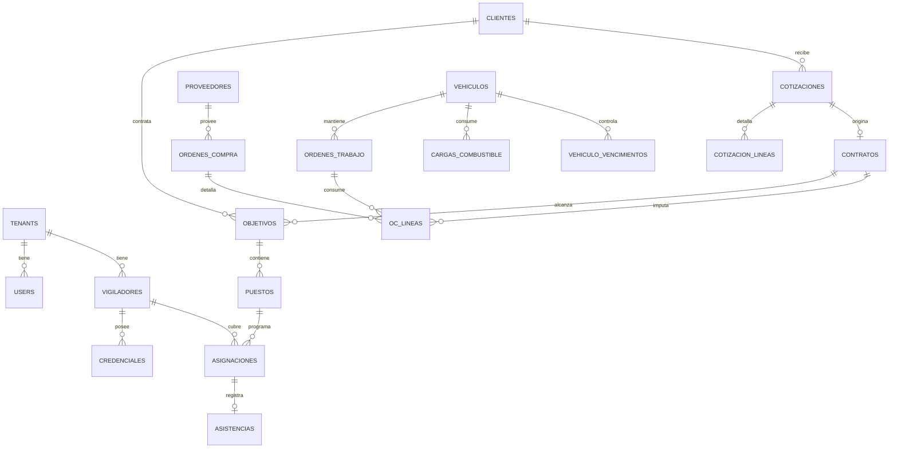

# Prompt arquitectónico — ERP SaaS para empresas de seguridad física (MVP)

> **Cómo usar este documento.** Es un prompt de construcción. Está escrito para que un equipo de desarrollo (o un equipo de agentes autónomos) lo tome como especificación única y produzca el MVP funcional. No es documentación de un sistema existente: es el contrato de lo que hay que construir. Donde dice "DEBE", es obligatorio; donde dice "PUEDE", queda a criterio de implementación.

---

## 1. Contexto de negocio y dominio

El producto es un ERP vertical, multi-empresa (SaaS), para empresas argentinas de seguridad física y vigilancia privada. Estas empresas venden **tiempo**: facturan a sus clientes horas-hombre (HH) por servicios de vigilancia fija, cobertura de eventos, custodia de caudales/mercadería, custodia de personas y rondas.

Tres verdades del dominio que el sistema DEBE respetar:

1. **El inventario es perecedero.** Una hora-hombre no facturada se pierde. La planificación de turnos y la captura de asistencia son el corazón, no un accesorio.

2. **El factor de cobertura.** Para cubrir un puesto 24/7 no alcanza un vigilador. Una semana tiene 168 h y la jornada legal ronda las 48 h; sumando francos, vacaciones por antigüedad, feriados, licencias y ausentismo, la dotación real por puesto 24/7 es de ~4,2 a 4,5 personas. Cotizar sin internalizar este factor produce contratos a pérdida. El factor DEBE ser parametrizable por tenant y por esquema de turno.

3. **El margen vive en dos conciliaciones.** (a) HH planificadas vs. HH reales vs. HH facturadas vs. HH pagadas. (b) Costo presupuestado vs. costo real (compras + flota + mano de obra) imputado a cada contrato. El sistema DEBE hacer ambas conciliaciones visibles por contrato/objetivo.

### Marco regulatorio argentino (relevante para el modelo de datos)

- **Personal habilitado.** Cada vigilador requiere credenciales vigentes: carnet de vigilador (régimen provincial; cada provincia tiene el suyo), apto psicofísico, certificado de antecedentes, capacitaciones. Personal armado requiere además credenciales ANMAC (CLU / tenencia). El sistema DEBE bloquear la asignación de un vigilador con credencial vencida a un puesto que la requiera.
- **Convenio.** La liquidación de haberes se rige por el CCT de vigilancia (familia 507/07): adicionales por nocturnidad, antigüedad, presentismo, francos, feriados. El MVP modela los conceptos pero la liquidación completa es de fase posterior.
- **Fiscal.** Facturación electrónica vía ARCA (ex-AFIP). El MVP deja los puntos de integración preparados; la emisión es de fase posterior.

---

## 2. Objetivo y alcance del MVP

**Objetivo:** entregar la cuña vendible que reemplace planillas de Excel y grupos de WhatsApp, resolviendo cuadrante, control de credenciales, cotización correcta, operación diaria y control de costos (compras + flota) imputado al margen.

### Dentro del alcance (MVP)

- M1 — Núcleo: motor de tiempo (cuadrante, asistencia, conciliación HH).
- M2 — Maestro de personal y credenciales.
- M3 — Comercial y cotizador (con factor de cobertura).
- M4 — Operaciones (objetivos, puestos, relevos, rondas, novedades).
- M5 — **Compras** (control de salidas de dinero, imputación a contrato).
- M6 — **Flota** (mantenimiento y seguimiento de móviles).
- Plataforma: multi-tenant, autenticación, RBAC, auditoría, notificaciones, canal WhatsApp para cotización/consulta.

### Fuera del alcance (fases posteriores)

- Liquidación de haberes completa (CCT 507/07 con cálculo).
- Emisión fiscal ARCA.
- Portal del cliente externo.
- Tablero BI avanzado (el MVP entrega métricas básicas).
- Telemetría GPS en vivo de flota (el MVP modela datos, no integra hardware).

---

## 3. Principios de arquitectura

- **Monolito modular.** Una sola aplicación NestJS organizada por módulos de dominio (un módulo Nest por cada M1–M6 + módulos transversales). Sin microservicios en el MVP; el límite entre módulos DEBE ser explícito para permitir extracción futura.
- **Multi-tenancy desde el día uno.** Aislamiento por `tenant_id` con Row-Level Security (RLS) en PostgreSQL. Toda fila de toda tabla de negocio lleva `tenant_id`. Ninguna consulta puede cruzar tenants.
- **Dominio sobre infraestructura.** La lógica de negocio (factor de cobertura, conciliación HH, imputación de costos) vive en servicios de dominio puros, testeables sin base de datos.
- **Eventos internos.** Acciones con efectos cruzados (alta de asistencia, recepción de OC, cierre de OT de flota) emiten eventos de dominio que el motor de rentabilidad consume. Usar un event bus en proceso (NestJS `EventEmitter2`) en el MVP.
- **Trazabilidad total.** Auditoría (quién, qué, cuándo) en todas las entidades; soft-delete; timestamps `created_at`/`updated_at`.

---

## 4. Stack técnico

| Capa | Tecnología |
|---|---|
| Backend | NestJS (Node 20 LTS, TypeScript), arquitectura modular |
| ORM | Prisma o TypeORM (elegir uno; preferencia Prisma por DX) |
| Base de datos | PostgreSQL 16 con RLS |
| Cache / colas | Redis 7 + BullMQ (jobs: recordatorios de vencimiento, recálculo de cuadrante, notificaciones) |
| Almacenamiento de archivos | MinIO (S3-compatible): fotos de credenciales, documentación de vehículos, comprobantes de compra |
| Frontend | React 18 + TypeScript + Vite; UI con Tailwind + componentes accesibles |
| IA | API de Anthropic (Claude) como motor conversacional del cotizador y asistente operativo. Modelo: `claude-sonnet-4-6` |
| Canal mensajería | Gateway WhatsApp (webhook entrante/saliente; abstraer detrás de una interfaz `ChannelProvider`) |
| Contenedores | Docker + Docker Compose |
| Auth | JWT (access + refresh) con guardas por rol y por tenant |

---

## 5. Convenciones transversales (obligatorias)

### Idioma

Toda la UI, mensajes, etiquetas, datos semilla y prompts de IA DEBEN estar en **español rioplatense** (Argentina). Nada de "tú/vosotros"; usar registro profesional argentino.

### Numeración

Documentos numerados por tenant y por año, con secuencia atómica (tabla de secuencias con bloqueo por fila). Prefijos por defecto (configurables por tenant):

| Entidad | Patrón | Ejemplo |
|---|---|---|
| Legajo de personal | `LEG-{AAAA}-{NNNN}` | `LEG-2026-0042` |
| Cliente | `CLI-{AAAA}-{NNNN}` | `CLI-2026-0007` |
| Objetivo (sitio) | `OBJ-{AAAA}-{NNNN}` | `OBJ-2026-0015` |
| Lead | `LEAD-{AAAA}-{NNNN}` | `LEAD-2026-0103` |
| Cotización | `COT-{AAAA}-{NNNN}-v{N}` | `COT-2026-0088-v2` |
| Contrato | `CTR-{AAAA}-{NNNN}` | `CTR-2026-0031` |
| Solicitud de compra | `SC-{AAAA}-{NNNN}` | `SC-2026-0211` |
| Orden de compra | `OC-{AAAA}-{NNNN}` | `OC-2026-0190` |
| Móvil (vehículo) | `MOV-{NNNN}` | `MOV-0012` |
| Orden de trabajo (flota) | `OT-{AAAA}-{NNNN}` | `OT-2026-0077` |

### Máquinas de estado

| Entidad | Estados |
|---|---|
| Lead | `NUEVO → CONTACTADO → COTIZADO → NEGOCIACION → GANADO` / `PERDIDO` |
| Cotización | `BORRADOR → ENVIADA → ACEPTADA` / `RECHAZADA` / `VENCIDA` |
| Asignación de cuadrante | `PLANIFICADA → CONFIRMADA → CUBIERTA` / `AUSENTE → RELEVADA` |
| Orden de compra | `BORRADOR → APROBADA → ENVIADA → RECIBIDA_PARCIAL → RECIBIDA → FACTURADA → PAGADA` / `ANULADA` |
| Orden de trabajo flota | `ABIERTA → EN_PROCESO → CERRADA` / `CANCELADA` |

### Reglas comunes

- Todas las entidades de negocio: `id (uuid)`, `tenant_id (uuid)`, `created_at`, `updated_at`, `deleted_at (nullable, soft-delete)`, `created_by`, `updated_by`.
- Montos en `numeric(14,2)`; moneda ARS por defecto, campo `moneda` para extensibilidad.
- Fechas/horas en UTC en base, presentación en `America/Argentina/Buenos_Aires`.

---

## 6. Módulos funcionales

### M1 — Núcleo: motor de tiempo (HH)

Responsable de planificar, capturar y conciliar horas-hombre.

- **Cuadrante (grilla de turnos).** Asignación de vigiladores a puestos a lo largo del tiempo. Detecta solapamientos, descansos insuficientes y huecos de cobertura. Genera turnos a partir de plantillas de esquema (ej. 12×12, 24×48, 8 h fijo).
- **Control de asistencia.** Fichaje de entrada/salida por geolocalización o checkpoint (QR/NFC). Registra hora real vs. planificada.
- **Conciliación HH.** Calcula, por puesto/contrato y período: HH planificadas, HH reales, HH facturables, HH a pagar. La diferencia HH facturables − HH a pagar alimenta el margen.
- **Reglas:** una asignación DEBE validar credenciales vigentes del vigilador (ver M2) y, si el puesto exige móvil, disponibilidad del vehículo (ver M6).

### M2 — Maestro de personal y credenciales

- Legajo del vigilador: datos personales, contacto, talles de uniforme, equipo asignado, foto.
- Credenciales con tipo, número, organismo emisor, fecha de emisión y **vencimiento**. Job diario que detecta vencimientos próximos (configurable, ej. 30/15/7 días) y notifica.
- **Bloqueo duro:** el motor de cuadrante NO puede asignar a un puesto que requiere armas a un vigilador sin credencial ANMAC vigente, ni a un puesto con habilitación provincial vencida.

### M3 — Comercial y cotizador

CRM liviano (leads → contratos) + **motor de cotización**. El cotizador es el diferencial comercial.

**Lógica del cotizador (servicio de dominio puro):**

1. Entrada: tipo de servicio, lista de puestos, esquema horario por puesto, fecha de inicio/fin.
2. Por cada puesto, calcular **horas a cubrir** en el período (`horas_dia × dias_periodo`).
3. Calcular **dotación necesaria** = `horas_a_cubrir / horas_efectivas_por_vigilador`, donde `horas_efectivas` descuenta francos, vacaciones, feriados y ausentismo (parametrizado por tenant). De forma equivalente, aplicar el **factor de cobertura** configurado.
4. Calcular **costo laboral por vigilador** = sueldo básico CCT + adicionales (nocturnidad, antigüedad, presentismo) + cargas sociales + ART + uniformes amortizados + capacitación.
5. **Costo del puesto** = `dotación × costo_laboral` + supervisión prorrateada + estructura + (si aplica) costo de móvil prorrateado desde M6.
6. **Precio** = `costo × (1 + margen_objetivo)`. El margen objetivo es parámetro del tenant y editable por cotización.
7. Salida: cotización versionada con desglose por puesto, HH totales, costo estimado, precio y margen estimado. El **costo estimado** se guarda como línea base para comparar luego contra el costo real (M5/M6).

El asistente conversacional (Claude) PUEDE asistir al usuario a armar la cotización por WhatsApp o web (ver §10), pero el cálculo numérico SIEMPRE lo hace el motor determinístico, no el modelo.

### M4 — Operaciones

- Maestro de objetivos (sitios del cliente) y puestos dentro de cada objetivo, con requisitos (armado/desarmado, móvil sí/no, esquema horario).
- Gestión de relevos: ante una ausencia, sugiere reemplazos elegibles (credenciales vigentes, sin solapamiento, dentro de límites de horas).
- Rondas de supervisión con checkpoints.
- Libro de novedades digital por objetivo (incidentes con timestamp, foto opcional, severidad).

### M5 — Compras (control de salidas de dinero, garantía de margen) — NUEVO

Objetivo: dar visibilidad y control sobre cada peso que sale, e **imputar el gasto al contrato/objetivo o centro de costo correspondiente**, para que el costo real impacte la rentabilidad.

**Entidades y flujo:**

- **Proveedores:** razón social, CUIT, condiciones de pago, rubro.
- **Solicitud de compra (SC):** la operación pide algo (uniformes, munición, repuestos, combustible, insumos, servicios). Lleva `centro_costo` y, opcionalmente, `contrato_id` / `objetivo_id` / `vehiculo_id` para imputación.
- **Orden de compra (OC):** se genera desde una o más SC aprobadas. Soporta múltiples líneas; cada línea hereda la imputación.
- **Workflow de aprobación por monto:** umbrales configurables por tenant (ej. < X aprueba supervisor; ≥ X aprueba gerencia). Una OC no pasa a `ENVIADA` sin aprobación.
- **Recepción:** total o parcial; descuenta sobre lo pedido.
- **Factura de proveedor y pago:** registra comprobante, vincula a OC, pasa a `FACTURADA` y luego `PAGADA`. Alimenta cuentas por pagar (AP).
- **Presupuesto por centro de costo / contrato:** alerta cuando el comprometido + ejecutado supera el presupuesto.

**Conexión con el margen (clave):** cada línea de OC con `contrato_id`/`objetivo_id` se acumula como **costo real de compras** de ese contrato. El motor de rentabilidad compara: `costo_estimado (de la cotización M3)` vs. `costo_real = HH_real + compras_imputadas + flota_imputada`. Si el costo real se acerca al precio, dispara alerta de erosión de margen.

### M6 — Flota: mantenimiento y seguimiento de móviles — NUEVO

Objetivo: mantener los móviles operativos, controlar vencimientos críticos y **trazar el costo total de cada vehículo, imputable a las operaciones que lo usan**.

**Entidades y reglas:**

- **Maestro de vehículos (móviles):** patente, marca/modelo, año, tipo (`COMUN` / `BLINDADO` / `MOTO`), kilometraje actual, estado (`OPERATIVO` / `EN_TALLER` / `BAJA`).
- **Vencimientos:** VTV, seguro, patente, habilitación especial (transporte de caudales/blindado). Job diario de alertas igual que credenciales de personal. **Bloqueo duro:** un móvil con VTV o seguro vencido NO puede asignarse a una operación.
- **Plan de mantenimiento preventivo:** disparadores por kilometraje (ej. service cada 10.000 km) o por tiempo (ej. cada 6 meses). Al alcanzar el umbral, genera automáticamente una OT preventiva.
- **Órdenes de trabajo (OT):** preventivas y correctivas. Estados `ABIERTA → EN_PROCESO → CERRADA`. Registra repuestos (vinculables a una OC de M5), mano de obra, taller, costo total.
- **Registro de combustible:** litros, importe, km al cargar → calcula rendimiento (km/l) y detecta consumos anómalos. Cada carga puede imputarse a un contrato/objetivo.
- **Asignación móvil + conductor a operación:** vincula con M4; el costo del móvil (depreciación + mantenimiento + combustible del período) se prorratea a las operaciones que lo usaron.
- **Costo total por vehículo (TCO)** y costo imputado por contrato, alimentando el motor de rentabilidad junto con M5.

---

## 7. Modelo de datos

ERD de núcleo + módulos nuevos (renderizable con Mermaid; los desarrolladores deben completar campos de detalle):



DDL representativo de las tablas más críticas (PostgreSQL; aplicar RLS por `tenant_id` en todas):

```sql
-- Tenants y RLS
create table tenants (
  id uuid primary key default gen_random_uuid(),
  nombre text not null,
  factor_cobertura numeric(4,2) not null default 4.20,
  margen_objetivo numeric(5,4) not null default 0.2500,
  created_at timestamptz not null default now()
);

-- Personal
create table vigiladores (
  id uuid primary key default gen_random_uuid(),
  tenant_id uuid not null references tenants(id),
  legajo_nro text not null,
  nombre text not null,
  apellido text not null,
  documento text not null,
  estado text not null default 'ACTIVO',
  created_at timestamptz not null default now(),
  updated_at timestamptz not null default now(),
  deleted_at timestamptz,
  unique (tenant_id, legajo_nro)
);

create table credenciales (
  id uuid primary key default gen_random_uuid(),
  tenant_id uuid not null references tenants(id),
  vigilador_id uuid not null references vigiladores(id),
  tipo text not null,            -- CARNET_VIGILADOR | PSICOFISICO | ANTECEDENTES | ANMAC | CAPACITACION
  numero text,
  organismo text,
  emitida_el date,
  vence_el date,                 -- clave para alertas y bloqueo
  created_at timestamptz not null default now()
);

-- Operaciones
create table objetivos (
  id uuid primary key default gen_random_uuid(),
  tenant_id uuid not null references tenants(id),
  cliente_id uuid not null,
  codigo text not null,
  nombre text not null,
  direccion text,
  unique (tenant_id, codigo)
);

create table puestos (
  id uuid primary key default gen_random_uuid(),
  tenant_id uuid not null references tenants(id),
  objetivo_id uuid not null references objetivos(id),
  requiere_arma boolean not null default false,
  requiere_movil boolean not null default false,
  esquema_horario jsonb not null   -- ej. {"tipo":"24x7","horas_dia":24,"dias":[1,2,3,4,5,6,7]}
);

create table asignaciones (
  id uuid primary key default gen_random_uuid(),
  tenant_id uuid not null references tenants(id),
  puesto_id uuid not null references puestos(id),
  vigilador_id uuid not null references vigiladores(id),
  inicio_plan timestamptz not null,
  fin_plan timestamptz not null,
  estado text not null default 'PLANIFICADA'
);

create table asistencias (
  id uuid primary key default gen_random_uuid(),
  tenant_id uuid not null references tenants(id),
  asignacion_id uuid not null references asignaciones(id),
  inicio_real timestamptz,
  fin_real timestamptz,
  metodo text,                   -- GEO | QR | NFC | MANUAL
  lat numeric(9,6), lng numeric(9,6)
);

-- Comercial
create table cotizaciones (
  id uuid primary key default gen_random_uuid(),
  tenant_id uuid not null references tenants(id),
  cliente_id uuid not null,
  codigo text not null,          -- COT-2026-0088-v2
  estado text not null default 'BORRADOR',
  costo_estimado numeric(14,2),  -- línea base para comparar contra costo real
  precio numeric(14,2),
  margen_estimado numeric(5,4),
  vence_el date,
  unique (tenant_id, codigo)
);

-- Compras (M5)
create table ordenes_compra (
  id uuid primary key default gen_random_uuid(),
  tenant_id uuid not null references tenants(id),
  proveedor_id uuid not null,
  codigo text not null,          -- OC-2026-0190
  estado text not null default 'BORRADOR',
  total numeric(14,2) not null default 0,
  aprobada_por uuid,
  unique (tenant_id, codigo)
);

create table oc_lineas (
  id uuid primary key default gen_random_uuid(),
  tenant_id uuid not null references tenants(id),
  orden_compra_id uuid not null references ordenes_compra(id),
  descripcion text not null,
  cantidad numeric(12,2) not null,
  precio_unit numeric(14,2) not null,
  subtotal numeric(14,2) not null,
  centro_costo text,
  contrato_id uuid,              -- imputación que alimenta el margen
  objetivo_id uuid,
  vehiculo_id uuid,              -- si es gasto de flota
  orden_trabajo_id uuid
);

-- Flota (M6)
create table vehiculos (
  id uuid primary key default gen_random_uuid(),
  tenant_id uuid not null references tenants(id),
  codigo text not null,          -- MOV-0012
  patente text not null,
  tipo text not null,            -- COMUN | BLINDADO | MOTO
  km_actual integer not null default 0,
  estado text not null default 'OPERATIVO',
  unique (tenant_id, codigo)
);

create table vehiculo_vencimientos (
  id uuid primary key default gen_random_uuid(),
  tenant_id uuid not null references tenants(id),
  vehiculo_id uuid not null references vehiculos(id),
  tipo text not null,            -- VTV | SEGURO | PATENTE | HABILITACION_CAUDALES
  vence_el date not null         -- bloqueo de asignación si vencido
);

create table ordenes_trabajo (
  id uuid primary key default gen_random_uuid(),
  tenant_id uuid not null references tenants(id),
  vehiculo_id uuid not null references vehiculos(id),
  codigo text not null,          -- OT-2026-0077
  tipo text not null,            -- PREVENTIVA | CORRECTIVA
  estado text not null default 'ABIERTA',
  km_al_abrir integer,
  costo_total numeric(14,2) not null default 0,
  unique (tenant_id, codigo)
);

create table cargas_combustible (
  id uuid primary key default gen_random_uuid(),
  tenant_id uuid not null references tenants(id),
  vehiculo_id uuid not null references vehiculos(id),
  fecha date not null,
  litros numeric(8,2) not null,
  importe numeric(14,2) not null,
  km integer not null,
  contrato_id uuid,
  objetivo_id uuid
);
```

> Habilitar RLS: `alter table <t> enable row level security;` y política `using (tenant_id = current_setting('app.tenant_id')::uuid)`. El backend setea `app.tenant_id` por conexión/solicitud.

---

## 8. Diseño de API (REST, prefijo `/api/v1`)

Todos los endpoints son tenant-scoped vía JWT. Selección representativa:

```
# Personal y credenciales
GET    /vigiladores
POST   /vigiladores
GET    /vigiladores/:id/credenciales
POST   /vigiladores/:id/credenciales
GET    /credenciales/por-vencer?dias=30

# Cuadrante y asistencia
GET    /puestos/:id/cuadrante?desde=&hasta=
POST   /asignaciones                       # valida credenciales + móvil
POST   /asignaciones/:id/relevo            # sugiere y asigna reemplazo
POST   /asistencias/fichar                 # body: { asignacion_id, metodo, lat, lng }
GET    /contratos/:id/conciliacion-hh?periodo=

# Comercial
POST   /cotizaciones/calcular              # motor determinístico, devuelve desglose
POST   /cotizaciones
POST   /cotizaciones/:id/enviar

# Compras
POST   /solicitudes-compra
POST   /ordenes-compra                     # desde SC aprobadas
POST   /ordenes-compra/:id/aprobar
POST   /ordenes-compra/:id/recepcion       # parcial o total
GET    /contratos/:id/costos               # HH + compras + flota imputados

# Flota
GET    /vehiculos
POST   /vehiculos/:id/vencimientos
GET    /vehiculos/vencimientos/por-vencer?dias=30
POST   /ordenes-trabajo
POST   /ordenes-trabajo/:id/cerrar
POST   /vehiculos/:id/combustible
GET    /vehiculos/:id/tco?periodo=

# Rentabilidad (consume eventos de todos los módulos)
GET    /rentabilidad/contratos?periodo=    # estimado vs real, alerta de erosión
```

---

## 9. Integraciones

- **WhatsApp.** Gateway con webhook entrante; abstraer detrás de `ChannelProvider` (interfaz con `recibir(mensaje)` / `enviar(destino, mensaje)`) para poder cambiar de proveedor. Flujos del MVP: solicitud de cotización guiada y consulta de novedades.
- **Claude API.** Asistente conversacional (§10). Llamadas server-side; nunca exponer la API key al frontend.
- **Fichaje.** Endpoint de asistencia acepta geolocalización y escaneo QR/NFC desde la app/web del vigilador.
- **ARCA.** Dejar interfaz `FacturadorFiscal` con implementación stub en el MVP.

---

## 10. IA — Prompt de sistema del asistente (cotizador/operativo)

El asistente ayuda a armar cotizaciones y responder consultas operativas. **No calcula precios él mismo**: cuando tiene los datos, invoca el endpoint `/cotizaciones/calcular` (vía tool/function calling) y presenta el resultado.

```
Sos el asistente de [NOMBRE_EMPRESA], una empresa de seguridad física.
Hablás en español rioplatense, claro y profesional, sin tecnicismos
innecesarios. Tu trabajo es ayudar a armar cotizaciones y responder
consultas operativas.

Reglas:
- Para cotizar, necesitás: tipo de servicio, cantidad de puestos,
  esquema horario de cada puesto (horas por día y días por semana),
  si requiere personal armado y si requiere móvil, y la duración.
- Cuando tengas esos datos, llamá a la herramienta calcular_cotizacion.
  NUNCA inventes ni estimes precios vos mismo: el cálculo lo hace el
  sistema, que ya considera el factor de cobertura y los costos reales.
- Si faltan datos, pedí solo lo que falta, una cosa a la vez.
- Si te preguntan por novedades o estado de un objetivo, consultá la
  herramienta correspondiente; no afirmes nada que no devuelva el sistema.
- No das asesoramiento legal ni fiscal.
```

Herramientas expuestas al modelo (function calling): `calcular_cotizacion`, `consultar_novedades`, `consultar_cuadrante`.

---

## 11. Seguridad, multi-tenancy y RBAC

- **Aislamiento:** RLS por `tenant_id` + `tenant_id` derivado del JWT en cada request. Tests que verifiquen que un usuario del tenant A no accede a datos del tenant B.
- **Roles (MVP):** `ADMIN`, `GERENCIA`, `SUPERVISOR`, `OPERADOR`, `RRHH`, `COMPRAS`. Guardas a nivel endpoint y a nivel campo donde corresponda (ej. costos solo `GERENCIA`/`ADMIN`).
- **Aprobaciones por monto** en Compras según rol y umbral del tenant.
- **Secrets** por variables de entorno; API keys nunca en el cliente.
- **Auditoría** inmutable de acciones sensibles (aprobación de OC, edición de cotización, baja de vehículo).

---

## 12. Estructura del repositorio

```
/apps
  /api                 # NestJS
    /src
      /modules
        /personal      # M2
        /tiempo        # M1 (cuadrante, asistencia, conciliacion)
        /comercial     # M3 (crm + cotizador)
        /operaciones   # M4
        /compras       # M5
        /flota         # M6
        /rentabilidad  # consume eventos de M1/M5/M6
        /iam           # auth, tenants, rbac
      /shared          # dominio puro, value objects, utilidades
  /web                 # React 18 + Vite
/packages
  /contracts           # DTOs/tipos compartidos api<->web
/infra
  docker-compose.yml
  /db/migrations
```

---

## 13. Docker Compose (servicios)

```yaml
services:
  api:
    build: ./apps/api
    env_file: .env
    depends_on: [postgres, redis, minio]
    ports: ["3000:3000"]

  web:
    build: ./apps/web
    depends_on: [api]
    ports: ["8080:80"]

  worker:
    build: ./apps/api
    command: ["node", "dist/worker.js"]   # jobs BullMQ: vencimientos, recalculo
    env_file: .env
    depends_on: [postgres, redis]

  postgres:
    image: postgres:16
    environment:
      POSTGRES_DB: erp_seguridad
      POSTGRES_PASSWORD: ${POSTGRES_PASSWORD}
    volumes: ["pgdata:/var/lib/postgresql/data"]
    ports: ["5432:5432"]

  redis:
    image: redis:7
    ports: ["6379:6379"]

  minio:
    image: minio/minio
    command: server /data --console-address ":9001"
    environment:
      MINIO_ROOT_USER: ${MINIO_USER}
      MINIO_ROOT_PASSWORD: ${MINIO_PASSWORD}
    volumes: ["miniodata:/data"]
    ports: ["9000:9000", "9001:9001"]

volumes:
  pgdata:
  miniodata:
```

Variables de entorno mínimas: `DATABASE_URL`, `REDIS_URL`, `JWT_SECRET`, `JWT_REFRESH_SECRET`, `ANTHROPIC_API_KEY`, `MINIO_*`, `WHATSAPP_*`.

---

## 14. Criterios de aceptación del MVP

1. Alta de tenant aislado; ningún dato cruza entre tenants (test automatizado).
2. Alta de vigilador con credenciales; el sistema bloquea asignar un vigilador con credencial vencida a un puesto que la exige.
3. Armado de cuadrante de un puesto 24/7 que detecta huecos de cobertura y solapamientos.
4. Fichaje con geolocalización y conciliación HH (planificadas vs. reales vs. facturables vs. a pagar) por contrato.
5. Cotización de un servicio multi-puesto que aplica el factor de cobertura y devuelve desglose, precio y margen estimado; queda versionada.
6. **Compras:** SC → OC con aprobación por monto → recepción parcial → factura; cada línea imputada a un contrato; el costo aparece en `/contratos/:id/costos`.
7. **Flota:** alta de móvil con vencimientos; bloqueo de asignación con VTV/seguro vencido; OT preventiva generada por umbral de km; carga de combustible con rendimiento calculado; TCO por vehículo.
8. **Rentabilidad:** un contrato muestra costo estimado vs. costo real (HH + compras + flota) y dispara alerta cuando el margen se erosiona bajo un umbral configurable.
9. Asistente conversacional que arma una cotización por WhatsApp invocando el motor determinístico (no inventa precios).

---

## 15. Roadmap posterior (fuera del MVP)

- Fase 2: liquidación de haberes completa (CCT 507/07) + facturación electrónica ARCA.
- Fase 3: portal del cliente, BI avanzado, módulo de cumplimiento documental, armamento/ANMAC detallado.
- Fase 4: onboarding self-service, telemetría GPS de flota en vivo, app móvil del vigilador offline-first.
```
